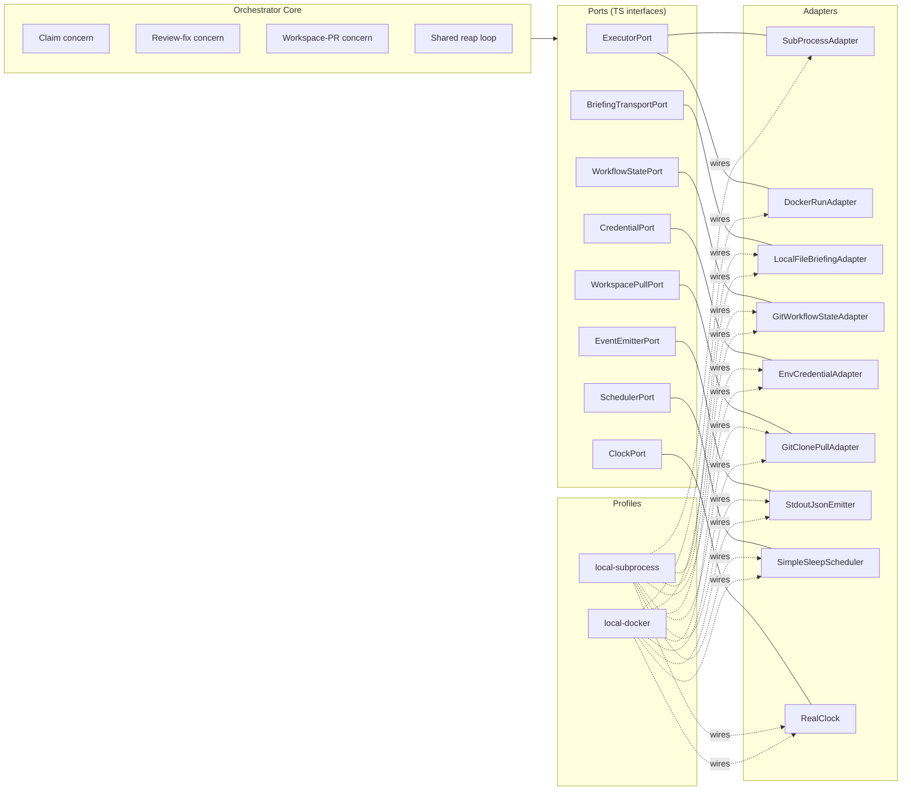

# Technical Design

## Feature
- Feature ID: `runtime-portable-architecture`
- Title: Portable runtime architecture — extract today's bundled orchestrator/executor into ports, adapters, and profiles

> Status: draft. Reflects the architectural direction agreed in
> `discussion-orchestrator-architecture.md`, scoped down to the
> architectural foundation only (no BYO executor, no customer-facing
> surface, no production adapters). The discussion doc remains the
> long-form reasoning record and includes the deferred BYO direction.

## Current State

Today's runtime is single-tenant, single-machine, and bundled:

- One Docker image contains both orchestrator (`runtime/orchestrator/`) and Claude executor (`runtime/executors/claude/`).
- A `docker compose up` starts one or more `agent-N` containers; each runs an orchestrator process.
- The orchestrator's claim cycle waits for the executor to finish a task before advancing: pull → eligibility → claim → spawn child → **await child exit** → dispatch result → sleep.
- Multiple agents run via multiple containers, coordinating only via git push race on GitHub.
- The `ExecutorAdapter` interface exists; `SubProcessAdapter` is its only implementation.
- Workflow state lives in the management git repo (one per workspace).

This architecture works for one team, one machine, one image. It does not support portable deployment, asynchronous concurrency, or any future feature that needs the orchestrator/executor seam to be more than a child-process boundary.

## Constraints

Lifted from the product spec:

1. **Workflow state remains in git.** No DB; no state migration.
2. **Same Claude executor image is used.** No second executor image is registered or run in this feature.
3. **Two profiles ship: `local-subprocess` and `local-docker`.** No production adapter in this feature.
4. **Orchestrator's cycle becomes asynchronous.** The blocking await-for-exit step is removed; results are reaped in a later cycle.
5. **Tenant context flows through orchestrator code paths.** Plumbed but not enforced.
6. **No customer-facing surface.** No registration, no conformance, no UI.

## Options Considered

### Decision D1 — Architectural pattern

#### Option D1a — Inline refactor (extend today's ExecutorAdapter)
Add new methods to `ExecutorAdapter` (`listCompleted`, `readResult`, `ack`); leave the rest of the runtime as-is. Lower upfront effort. Downside: the rest of the runtime stays coupled to inline assumptions (git in-process, stdout-only events, env-var-only credentials), so each future portability requirement is its own refactor.

#### Option D1b — Hexagonal / ports-and-adapters — **chosen**
Identify every place the orchestrator core touches the world (executor lifecycle, briefing transport, workflow state, credentials, image resolution, event emission, scheduling, time), promote each to a TypeScript port interface, and inject adapters at startup based on a named profile. Higher upfront effort; pays back the moment a second profile is added.

The discussion document covers the full reasoning. We are committing to D1b here.

### Decision D2 — Execution dispatch model

#### Option D2a — Keep the synchronous await (today)
`spawn()` then `await child.exit()`. Concurrency = pool size. Bursty load needs idle pods. Doesn't scale beyond a single machine.

#### Option D2b — Asynchronous submit + reap — **chosen**
The orchestrator calls `submit()` to dispatch a task, immediately stores the returned handle, and returns to its loop. A separate reap step in a later cycle calls `listCompleted()`, then `readResult()` on each completed handle, then `ack()`. The orchestrator's cycle never waits for any single executor to finish.

This is the substantive change in the runtime's behaviour. Pool size is decoupled from concurrent task count.

### Decision D3 — Where the asynchronous-completion mechanism lives

The async pattern still has to physically work for the bundled Claude executor in the local profiles. Two ways the local-docker profile can deliver completions:

#### Option D3a — Poll Docker container state
Orchestrator periodically lists Docker containers labelled `platform=true` and checks which have exited. `readResult` reads the result file from a shared host volume.

#### Option D3b — Per-container watch
Each `submit` registers a Docker `wait` callback on the spawned container; completions arrive as events.

**Chosen: D3a (polling).** Simpler, mirrors how production adapters will discover completion (poll an API, list a queue), and exercises the same code path that future profiles will use.

### Decision D4 — Profile mechanism shape

#### Option D4a — Compile-time profile selection
A build-time flag determines which adapter set is wired. Smaller binary, less flexibility.

#### Option D4b — Runtime profile selection — **chosen**
A `--profile` argument or `agent.yaml` field selects from a registered profile catalogue at startup. One binary supports every profile. Per-port overrides are also runtime-selectable, useful for surgical debug ("run with `local-docker` but emit events to stdout").

## Chosen Design

### Architectural pattern: hexagonal (ports + adapters)

The orchestrator core depends only on a fixed set of TypeScript interfaces ("ports"). Concrete implementations ("adapters") are wired into those ports at startup based on a named "profile". The same orchestrator binary runs in every profile; only the adapter set differs.

See `discussion-orchestrator-architecture.md` Appendix A for the full reasoning, port-level table, and profile compositions. See Appendix B in that document for the system diagram.

### The ports

The orchestrator core depends on these interfaces. Each has at least one adapter implementation in this feature.

| Port | Purpose |
|---|---|
| `ExecutorPort` | Full executor lifecycle: `submit`, `listCompleted`, `readResult`, `ack`. |
| `BriefingTransportPort` | Deliver briefing.md to the executor. |
| `WorkflowStatePort` | Read/write task YAML, append logs. Backed by git in every profile. |
| `CredentialPort` | Provide credentials to the executor. In this feature: pass-through from env vars. |
| `WorkspacePullPort` | Materialize the customer's workspace repo for the orchestrator's use. |
| `EventEmitterPort` | Emit structured events / metrics. |
| `SchedulerPort` | Cycle cadence. |
| `ClockPort` | Time, sleep, deadlines (mocked in tests). |

`ImageResolverPort` is **deferred** to the BYO feature — in this feature there is only one image (the Claude executor) so resolution is trivially static.

### The `ExecutorPort` contract

```ts
interface ExecutorPort {
  /** Submit a task; returns a handle. Returns immediately — does NOT
   *  wait for the executor to finish. */
  submit(input: ExecutorInput): Promise<ExecutorHandle>;

  /** List every previously-submitted task that has finished
   *  (completed, failed, timed out) and is ready to be reaped. */
  listCompleted(): Promise<ExecutorCompletion[]>;

  /** Read the full result for a given handle. */
  readResult(handle: ExecutorHandle): Promise<ExecutorResult>;

  /** Mark the result as reaped (clean up Docker container, delete temp
   *  file, etc.) so the same result is not delivered twice. */
  ack(handle: ExecutorHandle): Promise<void>;
}
```

The orchestrator's claim and review-fix concerns depend only on these four methods. **`submit` is non-blocking** — it returns as soon as the task has been dispatched, not when the task has finished. Today's blocking `spawn + await exit` flow is replaced.

### The three workflow concerns

The orchestrator pool runs three concerns:

1. **Claim concern.** Polls workspace repos, claims eligible tasks via git push race, calls `ExecutorPort.submit()` to dispatch the task, records the handle on the task YAML, returns. **Spawns one executor per claim, but does not wait for it.**
2. **Review-fix concern.** Polls in-review PRs. For tier-1 conflicts, calls `submit` (`subkind=rebase`) to spawn an executor that resolves conflict markers. For unresolved review threads, calls `submit` (`subkind=respond`) to spawn an executor that addresses comments. Same non-blocking flow as claim.
3. **Workspace-PR lifecycle concern.** Pure git/API operations: open the management-repo PR at claim time, merge it when the impl PR merges, recover stuck PRs. Never spawns an executor.

A **shared reap loop** alongside the concerns enumerates completed handles via `ExecutorPort.listCompleted()`, routes each completion by its handle's label kind (`impl` → claim concern's dispatcher; `review-fix` → review-fix dispatcher), reads the result, dispatches side-effects, and acks the handle.

### Profiles shipped in this feature

| Profile | `ExecutorPort` adapter | Purpose |
|---|---|---|
| `local-subprocess` | `SubProcessAdapter` | Mirrors today's behaviour. Bundled image, child-process spawn. The async submit/reap pattern is implemented internally — `submit` starts the child and returns immediately; `listCompleted` checks child process state. |
| `local-docker` | `DockerRunAdapter` | M:N profile. Orchestrator container has the Docker socket mounted. `submit` does `docker run` of the same Claude executor image as a per-task ephemeral container. `listCompleted` polls Docker for exited containers. `readResult` reads from a shared host volume. `ack` removes the container. |

Both profiles use the same orchestrator binary, the same executor image, and the same async cycle. They differ only in the `ExecutorPort` adapter.

### Loop topology

Day 1: one sequential cycle inside an orchestrator process — claim concern, then review-fix, then workspace-PR-lifecycle, then sleep. Mirrors today's `agent-loop.ts`. Splits into independent concurrent loops only when measured cadence needs diverge. Detail in `discussion-orchestrator-architecture.md`.

### Workflow state pattern

Git remains authoritative. The `WorkflowStatePort` adapter clones each workspace repo, reads/writes task YAMLs, commits and pushes. Behaviourally identical to today.

### Tenant-context plumbing

Every port method takes a `tenant_id` parameter (or carries it via context object). In this feature the value is always the same single tenant — but the call-site shape is now ready for the future multi-tenant feature to add real values without modifying every call site.

The exact extent of plumbing depends on the answer to product-spec B2.

## Architecture diagrams

### Hexagon view — orchestrator core surrounded by ports

```
                          ┌─────────────────────────┐
                          │     SchedulerPort       │
                          │   (cycle cadence)       │
                          └───────────┬─────────────┘
                                      │
   ┌─────────────────────┐       ╱─────────╲       ┌─────────────────────┐
   │     ClockPort       │──────╱           ╲──────│   EventEmitterPort  │
   │   (time, sleep)     │     ╱             ╲     │  (events / metrics) │
   └─────────────────────┘    ╱               ╲    └─────────────────────┘
                             ╱                 ╲
   ┌─────────────────────┐  ╱   ORCHESTRATOR    ╲  ┌─────────────────────┐
   │ BriefingTransport   │ ╱        CORE         ╲ │  WorkflowStatePort  │
   │   Port              │─                      ─│  (task YAML / git)  │
   │ (deliver briefing)  │ ╲   • claim concern   ╱ └─────────────────────┘
   └─────────────────────┘  ╲  • review-fix     ╱
                             ╲ • workspace-PR  ╱
   ┌─────────────────────┐    ╲• shared reap  ╱    ┌─────────────────────┐
   │   CredentialPort    │     ╲             ╱     │  WorkspacePullPort  │
   │ (creds → executor)  │──────╲           ╱──────│  (clone workspace)  │
   └─────────────────────┘       ╲─────────╱       └─────────────────────┘
                                      │
                          ┌───────────┴─────────────┐
                          │     ExecutorPort        │
                          │  submit · listCompleted │
                          │     readResult · ack    │
                          └─────────────────────────┘

      ── core depends ONLY on port interfaces; never on a concrete adapter ──
```

### Async submit/reap flow through `ExecutorPort`

```
     ┌────────────────────┐          ┌─────────────────────┐
     │  Claim concern     │          │  Review-fix concern │
     └─────────┬──────────┘          └──────────┬──────────┘
               │ submit(ExecutorInput)          │ submit(ExecutorInput)
               ▼                                 ▼
     ╔═════════════════════════════════════════════════════╗
     ║                  ExecutorPort                       ║
     ║   submit ─► returns ExecutorHandle (immediately)    ║
     ╚═════════════════════════════════════════════════════╝
                              │
            (work runs out-of-band: child proc / docker run)
                              │
                              ▼
     ╔═════════════════════════════════════════════════════╗
     ║   listCompleted()  ─►  [handle₁, handle₂, …]        ║
     ║   readResult(h)    ─►  ExecutorResult               ║
     ║   ack(h)                                            ║
     ╚═════════════════════════════════════════════════════╝
                              ▲
                              │ once per cycle
               ┌──────────────┴───────────────┐
               │       Shared reap loop       │
               │  routes by handle.kind →     │
               │  claim dispatcher / review-  │
               │  fix dispatcher              │
               └──────────────────────────────┘
```

### Mermaid view — profile wiring



## Implementation Waves

The work is naturally five waves. Waves can be implemented and merged independently with no broken-state intermediate.

### Wave 1 — Port interfaces + fake adapters

Define every port interface in `runtime/abi/` (or a new `runtime/orchestrator/ports/`). Add a fake adapter for each port. This wave delivers no behaviour change — fake adapters and unused interfaces.

### Wave 2 — Extract today's behaviour into adapters; wire `local-subprocess` profile

Refactor today's inline orchestrator code so each side effect goes through a port:
- `SubProcessAdapter` for `ExecutorPort`
- `LocalFileBriefingAdapter` for `BriefingTransportPort`
- `GitWorkflowStateAdapter` for `WorkflowStatePort`
- `EnvCredentialAdapter` for `CredentialPort`
- `GitClonePullAdapter` for `WorkspacePullPort`
- `StdoutJsonEmitter` for `EventEmitterPort`
- `SimpleSleepScheduler` for `SchedulerPort`
- `RealClock` for `ClockPort`

Define the `local-subprocess` profile factory bundling these. Wire the orchestrator core to use the port interfaces.

End of wave: today's behaviour is preserved. No new external behaviour visible.

### Wave 3 — Convert `ExecutorPort` to non-blocking submit/reap

Inside `SubProcessAdapter`:
- `submit` spawns the child and returns a handle keyed by PID.
- `listCompleted` checks child state via `wait4` / Node's `child.on('exit')` callbacks (internally tracked).
- `readResult` reads `RESULT_PATH` from the spawned child's working directory.
- `ack` cleans up the temp result file.

Refactor the orchestrator's claim and review-fix concerns to:
- Call `submit` instead of `spawn + await exit`.
- Add a shared reap loop that calls `listCompleted` and routes results.

End of wave: orchestrator's cycle no longer waits for executor exits. Concurrency improves on a single machine. Pool size becomes independent of task count.

### Wave 4 — `DockerRunAdapter` and `local-docker` profile

Implement `DockerRunAdapter`:
- `submit` calls `docker run -d` with mounted briefing volume, env vars, label.
- `listCompleted` polls `docker ps -a -f status=exited -f label=platform=true`.
- `readResult` reads from the shared host volume.
- `ack` runs `docker rm`.

Define the `local-docker` profile factory. Update `docker-compose.yml` template to mount the Docker socket into orchestrator containers. The Claude executor image is unchanged.

End of wave: M:N is functional locally. Multiple orchestrators each spawn their own per-task Claude executor containers. The architecture is proven.

### Wave 5 — Documentation, fake-orchestrator harness, port spec

- Author `runtime/portability-spec.md` documenting every port and adapter.
- Update the executor team's `fake-orchestrator` harness to use the new `ExecutorPort` contract so executor authors test against an interface the platform actually uses.
- Update `CLAUDE.md` references where they assume the bundled-image model.
- Documentation for adding a new profile.

End of wave: feature is shippable; future profiles can be added by registering a factory.

## Dependency Analysis

### External
- `@workflow/runtime-abi` — extend with handle / completion / label types. Bump minor version.
- Docker socket access in compose — already partially in place; needs verification across local profiles.

### Cross-feature
- `agent-runtime-split` (T1–T7, all done) — provides today's `ExecutorAdapter` interface, which Wave 2 generalizes. No further work required from that feature.
- No other in-flight features block this.

### Codebase prerequisites
None. Work begins immediately on Wave 1.

## Parallelization

- Waves 1, 2, 3, 4, 5 are strictly sequential — each depends on the previous.
- Within Wave 1, individual port-and-fake pairs are parallelizable across engineers.
- Within Wave 2, individual adapter extractions are parallelizable as long as the orchestrator core's wiring change is done last.
- Wave 5 (docs / harness updates) can begin during Wave 4 since the contract is stable by then.

## Open technical questions

To resolve in technical design review.

### T-Q1 — Where does `listCompleted` live?
Inside the `ExecutorPort` adapter (each adapter tracks its own outstanding handles), or in a shared in-memory registry the adapter writes to? Recommend the former — keeps each adapter self-contained.

### T-Q2 — How does the reap loop know which concern to route to?
Two options: (a) handles carry a label / metadata identifying their originating concern (claim / review-fix / subkind=rebase / subkind=respond); (b) the orchestrator maintains a side-table mapping handles to concerns. Recommend (a) — simpler, stateless reap loop.

### T-Q3 — Tenant-context plumbing depth
Bound by product-spec B2. Recommend: define `WorkflowContext` interface containing `tenantId`, plumb it through orchestrator core function signatures, accept always-default value at call sites today.

### T-Q4 — Per-cycle sequencing of submit and reap
Single sequential cycle on day 1 (Shape A from the discussion doc). The reap step runs once per cycle, after the claim and review-fix concerns finish their submissions. Confirm this is acceptable for UX latency in review-fix completion display.

### T-Q5 — Test-suite shape
Hermetic core tests via fake adapters; profile-level integration tests pinning behavioural parity (`local-subprocess` vs `local-docker` produce identical outcomes for a fixed test workspace). Should we also have a "burn-in" integration test that runs N concurrent tasks under `local-docker` to validate the async path under load?

### T-Q6 — Runner agent and pull-family deferral
Runner agents and pull-family adapters are deferred to the BYO feature. But should we sketch the `RunnerProtocolAdapter` interface in this feature so the BYO feature is purely additive, or leave it entirely to that feature? Recommend: leave to that feature; ports we know we need now is enough.

## Success criteria

Mirrored from `product-spec.md`:

1. `local-subprocess` profile preserves today's behaviour exactly.
2. `local-docker` profile works end-to-end: M orchestrator containers spawning per-task Claude executor containers via Docker socket, tasks complete identically.
3. Orchestrator cycle no longer waits for an executor to finish.
4. Every port has a fake adapter; orchestrator core has hermetic test suite.
5. Adding a new profile is a registration call, no core changes.

## References

- `product-spec.md` — feature scope, success criteria, open business questions
- `discussion-orchestrator-architecture.md` — long-form architectural reasoning, system diagram, port table, profile catalogue, deferred BYO direction
- `agent-runtime-split` feature — provides the ABI foundation this design builds on
