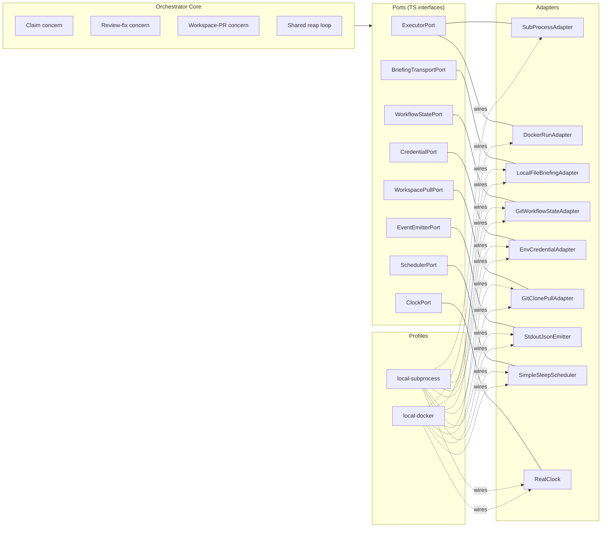

# Technical Design

## Feature
- Feature ID: `runtime-portable-architecture`
- Title: Portable runtime architecture — extract today's bundled orchestrator/executor into ports, adapters, and profiles

> Status: draft. Reflects the architectural direction agreed in
> `discussion-orchestrator-architecture.md`, scoped down to the
> architectural foundation only (no BYO executor, no customer-facing
> surface, no production adapters). The discussion doc remains the
> long-form reasoning record and includes the deferred BYO direction.

## Current State

Today's runtime is single-tenant, single-machine, and bundled:

- One Docker image contains both orchestrator (`runtime/orchestrator/`) and Claude executor (`runtime/executors/claude/`).
- A `docker compose up` starts one or more `agent-N` containers; each runs an orchestrator process.
- The orchestrator's claim cycle waits for the executor to finish a task before advancing: pull → eligibility → claim → spawn child → **await child exit** → dispatch result → sleep.
- Multiple agents run via multiple containers, coordinating only via git push race on GitHub.
- The `ExecutorAdapter` interface exists; `SubProcessAdapter` is its only implementation.
- Workflow state lives in the management git repo (one per workspace).

This architecture works for one team, one machine, one image. It does not support portable deployment, asynchronous concurrency, or any future feature that needs the orchestrator/executor seam to be more than a child-process boundary.

## Constraints

Lifted from the product spec:

1. **Workflow state remains in git.** No DB; no state migration.
2. **Same Claude executor image is used.** No second executor image is registered or run in this feature.
3. **Two profiles ship: `local-subprocess` and `local-docker`.** No production adapter in this feature.
4. **Orchestrator's cycle becomes asynchronous.** The blocking await-for-exit step is removed; results are reaped in a later cycle.
5. **Tenant context flows through orchestrator code paths.** Plumbed but not enforced.
6. **No customer-facing surface.** No registration, no conformance, no UI.
7. **HTTP callback transport ships in this feature.** Both local profiles use the same HTTP callback path the future production/BYO feature will use; loopback for `local-subprocess`, host-network or `host.docker.internal` for `local-docker`. Authentication ships as nonce-only (HMAC deferred — see D5).

## Options Considered

### Decision D1 — Architectural pattern

#### Option D1a — Inline refactor (extend today's ExecutorAdapter)
Add new methods to `ExecutorAdapter` (`listCompleted`, `readResult`, `ack`); leave the rest of the runtime as-is. Lower upfront effort. Downside: the rest of the runtime stays coupled to inline assumptions (git in-process, stdout-only events, env-var-only credentials), so each future portability requirement is its own refactor.

#### Option D1b — Hexagonal / ports-and-adapters — **chosen**
Identify every place the orchestrator core touches the world (executor lifecycle, briefing transport, workflow state, credentials, image resolution, event emission, scheduling, time), promote each to a TypeScript port interface, and inject adapters at startup based on a named profile. Higher upfront effort; pays back the moment a second profile is added.

The discussion document covers the full reasoning. We are committing to D1b here.

### Decision D2 — Execution dispatch model

#### Option D2a — Keep the synchronous await (today)
`spawn()` then `await child.exit()`. Concurrency = pool size. Bursty load needs idle pods. Doesn't scale beyond a single machine.

#### Option D2b — Asynchronous submit + reap — **chosen**
The orchestrator calls `submit()` to dispatch a task, immediately stores the returned handle, and returns to its loop. A separate reap step in a later cycle calls `listCompleted()`, then `readResult()` on each completed handle, then `ack()`. The orchestrator's cycle never waits for any single executor to finish.

This is the substantive change in the runtime's behaviour. Pool size is decoupled from concurrent task count.

### Decision D3 — How completions are delivered

The async pattern still has to physically work for the bundled Claude executor in the local profiles. Three shapes considered:

#### Option D3a — Poll the runtime by label (orchestrator → executor)
Orchestrator periodically lists Docker containers labelled `platform=true` and checks which have exited. `readResult` reads the result file from a shared host volume.

Rejected. Three problems:
1. It assumes the runtime supports a label-filtered list-and-scan API. Docker and Kubernetes do; many other runtimes (queue-based workers, serverless functions, BYO customer-side runners) do not.
2. It assumes the set of "things tagged `platform=true`" is uniquely owned by *this* orchestrator. False on shared infra, on multi-orchestrator hosts, after a crash leaves orphans, when other tools also label things.
3. Its supposed virtue ("mirrors how production adapters discover completion") doesn't hold — most production runtimes give you a handle and you ask about it, not a label-filtered global scan.

#### Option D3b — Per-handle watch (orchestrator → executor)
Each `submit` registers a `docker wait` (or equivalent) on the spawned container; completions arrive as events the adapter pushes onto its completion buffer.

Better than D3a but still requires the orchestrator to be able to *reach into* the runtime to observe state. Fine for subprocess and local-docker, broken for any topology where the orchestrator cannot initiate contact with the executor's runtime — most notably pull-family customer runners (the deferred BYO direction).

#### Option D3c — Runner callback (executor → orchestrator) — **chosen**
Reverse the direction. At `submit` time the adapter passes the runner a callback target (an HTTP URL + per-handle nonce) alongside the briefing path. When the executor finishes, the *runner* (a small wrapper hosting the executor — see D6) POSTs the result and nonce back to the orchestrator's HTTP receiver, which validates the nonce and pushes the completion onto the adapter's **completion buffer** — an in-memory, in-process data structure (e.g. `Map<handle, completion>`) local to that orchestrator process. `listCompleted` drains the buffer. The buffer is not a message broker, not persistent, not shared across orchestrators; it lives and dies with the orchestrator process.

The HTTP transport is used by **both** local profiles — `local-subprocess` POSTs over loopback, `local-docker` POSTs to the host network or `host.docker.internal`. The future production/BYO feature reuses the same receiver code path; it adds HMAC authentication (D5) and a per-tenant addressing layer, not a new transport.

Why this is the right shape:
- **One direction works everywhere.** Subprocess, local-docker, future K8s, future queue-based workers, and future BYO customer runners all share the same property: they have outbound reach to the orchestrator (loopback, host network, egress to a known endpoint). Even pull-family BYO runners — which by definition cannot accept inbound from us — can call us back outbound. This dissolves the push-vs-pull dichotomy at the completion-delivery layer.
- **No leaked discovery mechanism.** The port contract doesn't presume labels, scans, watches, or any specific runtime API.
- **One transport, exercised every dev cycle.** Both local profiles use the same HTTP receiver the production feature will use. There is no in-process special case; the production code path is exercised on every laptop run. Loopback HTTP overhead on `local-subprocess` is microseconds — negligible.
- **Restart durability is explicit, not implicit.** Callbacks fired while the orchestrator is down are lost. On startup the orchestrator scans in-flight task YAMLs (handles are persisted there at claim time) and reconciles — runtime-specific reconciliation (`docker inspect`, k8s lookup) is a fallback for stuck handles, not the primary path.
- **The executor image is unchanged.** The executor's contract remains "write `RESULT_PATH`, exit". The runner — not the executor — POSTs the result back (see D6).

The `ExecutorPort` contract is unchanged: four methods (`submit`, `listCompleted`, `readResult`, `ack`). Only the mechanism *inside* the adapter changes.

### Decision D4 — Profile mechanism shape

#### Option D4a — Compile-time profile selection
A build-time flag determines which adapter set is wired. Smaller binary, less flexibility.

#### Option D4b — Runtime profile selection — **chosen**
A `--profile` argument or `agent.yaml` field selects from a registered profile catalogue at startup. One binary supports every profile. Per-port overrides are also runtime-selectable, useful for surgical debug ("run with `local-docker` but emit events to stdout").

### Decision D5 — Callback authentication

The HTTP receiver must reject unauthorized callbacks (otherwise any process on the host could push fake completions onto the buffer). Two postures considered:

#### Option D5a — Per-handle nonce only — **chosen for this feature**
At `submit`, the orchestrator generates a random per-handle nonce, stores it on the in-flight registry, and includes it in the runner's env. The runner echoes the nonce in the callback. The receiver rejects unknown nonces and replays (a nonce is invalidated as soon as its handle is acked). This is sufficient for the local profiles where traffic is loopback or a trusted dev bridge.

#### Option D5b — Per-handle nonce + HMAC-signed body — **deferred to production/BYO**
Same nonce mechanism plus the runner signs the request body with a per-tenant secret; receiver validates the signature. Necessary when traffic crosses untrusted intermediaries (the production/BYO topology). Out of scope here — the receiver is structured so HMAC validation is a drop-in middleware in the production feature, not a rewrite. The deferred-work note for that feature should call this out explicitly.

### Decision D6 — Runner shape (how the executor posts back)

The Claude executor image's contract is "write `RESULT_PATH`, exit". For the runner inside the container (or process tree) to POST the result, something has to wrap the executor invocation. Three ways:

#### Option D6a — Bake a wrapper into the executor image
Changes the executor's contract; couples the image to the platform's callback protocol. Rejected — the executor team owns the image and shouldn't be forced to follow platform-internal protocol changes there.

#### Option D6b — Sidecar / init-container
Adds a second container per task. Heavyweight for local profiles. Rejected.

#### Option D6c — Mount a wrapper at runtime; override the entrypoint — **chosen**
The orchestrator mounts a tiny platform-owned wrapper script (`runner.sh` or `runner.ts`) into the runner's process tree and runs it as the entrypoint. The wrapper exec's the bundled executor binary, then on exit reads `RESULT_PATH` and POSTs `{ handle, nonce, result }` to the orchestrator's HTTP receiver. The executor image stays unchanged; the wrapper is a platform-side artifact.

The same wrapper script works in both profiles — only the spawn mechanism differs (`fork` for subprocess, `docker run` for docker) and the `$CALLBACK_URL` env var (loopback vs host-network).

## Chosen Design

### Architectural pattern: hexagonal (ports + adapters)

The orchestrator core depends only on a fixed set of TypeScript interfaces ("ports"). Concrete implementations ("adapters") are wired into those ports at startup based on a named "profile". The same orchestrator binary runs in every profile; only the adapter set differs.

See `discussion-orchestrator-architecture.md` Appendix A for the full reasoning, port-level table, and profile compositions. See Appendix B in that document for the system diagram.

### The ports

The orchestrator core depends on these interfaces. Each has at least one adapter implementation in this feature.

| Port | Purpose |
|---|---|
| `ExecutorPort` | Full executor lifecycle: `submit`, `listCompleted`, `readResult`, `ack`. |
| `BriefingTransportPort` | Deliver briefing.md to the executor. |
| `WorkflowStatePort` | Read/write task YAML, append logs. Backed by git in every profile. |
| `CredentialPort` | Provide credentials to the executor. In this feature: pass-through from env vars. |
| `WorkspacePullPort` | Materialize the customer's workspace repo for the orchestrator's use. |
| `EventEmitterPort` | Emit structured events / metrics. |
| `SchedulerPort` | Cycle cadence. |
| `ClockPort` | Time, sleep, deadlines (mocked in tests). |

`ImageResolverPort` is **deferred** to the BYO feature — in this feature there is only one image (the Claude executor) so resolution is trivially static.

### The `ExecutorPort` contract

```ts
interface ExecutorPort {
  /** Submit a task; returns a handle. Returns immediately — does NOT
   *  wait for the executor to finish. */
  submit(input: ExecutorInput): Promise<ExecutorHandle>;

  /** List every previously-submitted task that has finished
   *  (completed, failed, timed out) and is ready to be reaped. */
  listCompleted(): Promise<ExecutorCompletion[]>;

  /** Read the full result for a given handle. */
  readResult(handle: ExecutorHandle): Promise<ExecutorResult>;

  /** Mark the result as reaped (clean up Docker container, delete temp
   *  file, etc.) so the same result is not delivered twice. */
  ack(handle: ExecutorHandle): Promise<void>;
}
```

The orchestrator's claim and review-fix concerns depend only on these four methods. **`submit` is non-blocking** — it returns as soon as the task has been dispatched, not when the task has finished. Today's blocking `spawn + await exit` flow is replaced.

`ExecutorInput` carries the orchestrator's HTTP callback URL and the per-handle nonce; the adapter passes both to the runner via env vars at spawn time. The runner POSTs `{ handle, nonce, result }` on completion. `listCompleted` drains the adapter's completion buffer, populated by validated callbacks. `readResult` returns the result the runner reported (or fetches a pointed-to artifact); `ack` invalidates the nonce, releases adapter-side state, and runs runtime-specific cleanup. Runtime-specific reconciliation (`docker inspect`, k8s lookup, etc.) is a fallback for dropped callbacks and stuck handles — not the primary discovery mechanism.

### The three workflow concerns

The orchestrator pool runs three concerns:

1. **Claim concern.** Polls workspace repos, claims eligible tasks via git push race, calls `ExecutorPort.submit()` to dispatch the task, records the handle on the task YAML, returns. **Spawns one executor per claim, but does not wait for it.**
2. **Review-fix concern.** Polls in-review PRs. For tier-1 conflicts, calls `submit` (`subkind=rebase`) to spawn an executor that resolves conflict markers. For unresolved review threads, calls `submit` (`subkind=respond`) to spawn an executor that addresses comments. Same non-blocking flow as claim.
3. **Workspace-PR lifecycle concern.** Pure git/API operations: open the management-repo PR at claim time, merge it when the impl PR merges, recover stuck PRs. Never spawns an executor.

A **shared reap loop** alongside the concerns calls `ExecutorPort.listCompleted()` to drain the adapter's completion buffer (populated by runner callbacks, see Decision D3), routes each completion by its handle's kind (`impl` → claim concern's dispatcher; `review-fix` → review-fix dispatcher), reads the result, dispatches side-effects, and acks the handle.

### Profiles shipped in this feature

| Profile | `ExecutorPort` adapter | Purpose |
|---|---|---|
| `local-subprocess` | `SubProcessAdapter` | Bundled image, child-process spawn. `submit` spawns the **runner wrapper** (D6c) as a child with env vars carrying the briefing path, callback URL (`http://127.0.0.1:<port>/callback`), and per-handle nonce. The wrapper exec's the executor binary; on exit, the wrapper reads `RESULT_PATH` and POSTs `{ handle, nonce, result }` to the orchestrator's HTTP receiver over loopback. The receiver validates the nonce and pushes onto the completion buffer. `listCompleted` drains the buffer. The parent process also observes child exit as a fallback for wrapper crashes (process killed before it could POST). |
| `local-docker` | `DockerRunAdapter` | M:N profile. Orchestrator container has the Docker socket mounted. `submit` does `docker run` of the Claude executor image with the **same runner wrapper** (D6c) mounted in and set as the entrypoint, with env vars carrying the briefing path, callback URL (host-network or `host.docker.internal:<port>`), and per-handle nonce. The wrapper exec's the executor binary inside the container; on exit it POSTs to the callback URL. The adapter holds a `docker wait` on the container as a fallback for callback failures. `readResult` returns the buffered result. `ack` invalidates the nonce and runs `docker rm`. |

Both profiles use the same orchestrator binary, the same executor image, and the same async cycle. They differ only in the `ExecutorPort` adapter.

### Loop topology

Day 1: one sequential cycle inside an orchestrator process — claim concern, then review-fix, then workspace-PR-lifecycle, then sleep. Mirrors today's `agent-loop.ts`. Splits into independent concurrent loops only when measured cadence needs diverge. Detail in `discussion-orchestrator-architecture.md`.

### Workflow state pattern

Git remains authoritative. The `WorkflowStatePort` adapter clones each workspace repo, reads/writes task YAMLs, commits and pushes. Behaviourally identical to today.

### Callback transport

Per Decisions D3c and D5a, completion is reported by the runner via HTTP POST to a per-orchestrator callback receiver. **Both local profiles use the same transport** — only the URL the runner POSTs to differs:

- `SubProcessAdapter` — runner POSTs to `http://127.0.0.1:<port>/callback` (loopback to the same orchestrator process).
- `DockerRunAdapter` — runner POSTs to `http://host.docker.internal:<port>/callback` (or to the orchestrator's host-network address; see T-Q7).

The receiver:
- Listens on a port chosen at orchestrator startup (configurable; default `0` for ephemeral, written to a runtime file the spawn code reads).
- Validates the per-handle nonce against the in-flight registry.
- On valid nonce, pushes the completion onto the buffer and returns 204. The nonce is invalidated on `ack`.
- On unknown / replayed nonce, returns 401. The orchestrator emits an event but does not crash.

The receiver is part of every orchestrator process, in both profiles. The future production/BYO feature reuses the same receiver code path; it adds HMAC validation as middleware (D5b) and a per-tenant addressing layer at the network edge — neither requires changes to the receiver itself.

### Tenant-context plumbing

Every port method takes a `tenant_id` parameter (or carries it via context object). In this feature the value is always the same single tenant — but the call-site shape is now ready for the future multi-tenant feature to add real values without modifying every call site.

The exact extent of plumbing depends on the answer to product-spec B2.

## Orchestrator runtime architecture

This section consolidates how an orchestrator process is structured at runtime, and how multiple orchestrator processes coexist. The hexagonal pattern (D1b) and the runner-callback model (D3c) leave several runtime questions implicit; this section makes them explicit.

### Inside one orchestrator process

An orchestrator is a single Node.js process running a sequential cycle (Shape A from the discussion doc):

1. **Claim concern** — polls workspaces, claims tasks via the git push race, calls `submit` for impl work.
2. **Review-fix concern** — polls in-review PRs, calls `submit` for rebase / respond-to-review work.
3. **Workspace-PR lifecycle concern** — pure git/API work; no executor.
4. **Shared reap loop** — calls `listCompleted` on the executor adapter, drains the completion buffer, routes results by `handle.kind`, calls `readResult` and `ack`.

The cycle is single-threaded (Node event loop). Concerns and the reap loop run sequentially within one cycle and yield at `await` points. This mirrors today's `agent-loop.ts`.

The `ExecutorPort` adapter (`SubProcessAdapter` or `DockerRunAdapter`) holds two in-process state stores:

- **Completion buffer** — a `Map<handle, completion>` in memory. Populated by the callback handler; drained by `listCompleted`. Non-persistent — gone when the process exits.
- **In-flight registry** — for each submitted handle, the adapter remembers what it spawned (PID, container ID), the per-handle nonce, and bookkeeping for fallback exit observation. Used by `readResult`, `ack`, and reconciliation.

Each orchestrator process also runs an **HTTP callback receiver** bound at startup. It exposes a single route (`POST /callback`) whose handler:

1. Validates the nonce against the in-flight registry.
2. On valid nonce, parses the body into a completion record and pushes it onto the buffer.
3. On unknown / replayed nonce, returns 401 and emits an event.

The receiver and the in-process state are co-located in the same Node process — the receiver is just a route in the same event loop as the concerns and the reap loop. The runner POSTs to its own orchestrator's URL (loopback for subprocess; host network for docker).

Because Node is single-threaded, no locks are required: receiver-handler pushes, exit-observer fallback pushes, and reap-loop drains all interleave at `await` points on the same event loop.

#### Fallback path: wrapper crashes before POST

The runner wrapper (D6c) does the POST. If the wrapper crashes (kill -9, OOM, segfault) before it can POST, the callback never arrives. To avoid leaking a hung handle:

- `SubProcessAdapter` keeps `child.on('exit')` as a fallback observer. If the child exits without a corresponding completion arriving on the buffer within a short grace window, the adapter pushes a synthetic `failed` completion (with the exit code and any stderr) onto the buffer using the same handler.
- `DockerRunAdapter` does the same with `docker wait`.

This makes the HTTP path the primary mechanism and the runtime-side exit observation the safety net — not the other way around.

### Multiple orchestrator processes

Multiple orchestrator processes run as **peers**, with no broker, no leader election, and no shared in-memory state. This is unchanged from today.

- Each orchestrator owns its own completion buffer and in-flight registry.
- Each orchestrator spawns its own runners; the callback target it hands the runner points back to **itself** (its own in-process function locally; its own HTTP listener address in production).
- Coordination across orchestrators happens **only** through the git claim race on the management repo — first-push-wins on a task's `in_progress` transition. Same mechanism as today.

A single task is therefore owned end-to-end by exactly one orchestrator: the one whose `claim` push won. Its runner reports completion to it, and it dispatches the result. Other orchestrators in the pool are not involved.

### Failure mode: submitter dies before the callback arrives

If orchestrator A submits a task and dies before its runner finishes:

- The runner's callback fails (in-process: parent gone with the runner; HTTP: target unreachable).
- The handle is persisted on the task YAML at submit time, so any other orchestrator can find the in-flight work.
- On startup or during a periodic in-flight sweep, an orchestrator scans task YAMLs for in-progress handles whose owning process is gone and reconciles via runtime-specific lookup (`docker inspect`, `docker logs`, future k8s API call) to retrieve the result.
- This reconciliation path is **fallback only**. Most callbacks land on a live orchestrator and use the buffer path.

For local profiles in this feature, this is rare in practice: orchestrators are co-located with their runners, and crash recovery is mostly about restarting cleanly. The failure mode becomes substantive when production HTTP transport ships.

### What's deferred to production / BYO

The HTTP receiver itself ships in this feature. What remains for the production/BYO feature to add:

- **HMAC-signed callbacks (D5b).** The receiver is structured so HMAC validation is a drop-in middleware in front of the existing nonce check. Threat-model assumption today: traffic is loopback or trusted dev bridge. That assumption breaks the moment the receiver is reachable across an untrusted network. **The BYO feature must add HMAC before exposing the receiver beyond the local host.**
- **Cross-orchestrator addressing.** When a runner cannot reach the original submitter (network partition, host failure, autoscaler scale-down), an alternate routing mechanism (sticky routing, persistent retry, broker-mediated fan-out) is required. Not needed in the local profiles where the runner is co-located with its submitter.
- **Pull-family runners.** Runner agents in customer infra that long-poll for work and call back outbound. The completion-delivery layer (locked down by D3c + the HTTP receiver shipped here) is shared with push-family; the dispatch layer (`submit` returning a "pull this" handle vs. an immediate-spawn handle) is the BYO feature's surface.
- **Multi-tenancy enforcement** at the receiver — per-tenant secrets, tenant identification from the request, isolation of in-flight state across tenants.

## Architecture diagrams

### Hexagon view — orchestrator core surrounded by ports

```
                          ┌─────────────────────────┐
                          │     SchedulerPort       │
                          │   (cycle cadence)       │
                          └───────────┬─────────────┘
                                      │
   ┌─────────────────────┐       ╱─────────╲       ┌─────────────────────┐
   │     ClockPort       │──────╱           ╲──────│   EventEmitterPort  │
   │   (time, sleep)     │     ╱             ╲     │  (events / metrics) │
   └─────────────────────┘    ╱               ╲    └─────────────────────┘
                             ╱                 ╲
   ┌─────────────────────┐  ╱   ORCHESTRATOR    ╲  ┌─────────────────────┐
   │ BriefingTransport   │ ╱        CORE         ╲ │  WorkflowStatePort  │
   │   Port              │─                      ─│  (task YAML / git)  │
   │ (deliver briefing)  │ ╲   • claim concern   ╱ └─────────────────────┘
   └─────────────────────┘  ╲  • review-fix     ╱
                             ╲ • workspace-PR  ╱
   ┌─────────────────────┐    ╲• shared reap  ╱    ┌─────────────────────┐
   │   CredentialPort    │     ╲             ╱     │  WorkspacePullPort  │
   │ (creds → executor)  │──────╲           ╱──────│  (clone workspace)  │
   └─────────────────────┘       ╲─────────╱       └─────────────────────┘
                                      │
                          ┌───────────┴─────────────┐
                          │     ExecutorPort        │
                          │  submit · listCompleted │
                          │     readResult · ack    │
                          └─────────────────────────┘

      ── core depends ONLY on port interfaces; never on a concrete adapter ──
```

### Layered view — how a profile wires adapters into ports

```
   ┌─────────────────────────────────────────────────────────────────┐
   │  PROFILE  (selected at startup via --profile or agent.yaml)     │
   │     local-subprocess                local-docker                │
   └──────────────────┬──────────────────────────┬───────────────────┘
                      │ injects                  │ injects
                      ▼                          ▼
   ┌─────────────────────────────────────────────────────────────────┐
   │  ADAPTERS                                                       │
   │   ExecutorPort         → SubProcessAdapter  | DockerRunAdapter  │
   │   BriefingTransport    → LocalFileBriefingAdapter               │
   │   WorkflowState        → GitWorkflowStateAdapter                │
   │   Credential           → EnvCredentialAdapter                   │
   │   WorkspacePull        → GitClonePullAdapter                    │
   │   EventEmitter         → StdoutJsonEmitter                      │
   │   Scheduler            → SimpleSleepScheduler                   │
   │   Clock                → RealClock                              │
   └─────────────────────────────────┬───────────────────────────────┘
                                     │ implement
                                     ▼
   ┌─────────────────────────────────────────────────────────────────┐
   │  PORTS  (TypeScript interfaces — the only thing core sees)      │
   └─────────────────────────────────┬───────────────────────────────┘
                                     │ depended on by
                                     ▼
   ┌─────────────────────────────────────────────────────────────────┐
   │  ORCHESTRATOR CORE                                              │
   │    Claim · Review-fix · Workspace-PR · Shared reap loop         │
   └─────────────────────────────────────────────────────────────────┘
```

### Async submit/reap flow through `ExecutorPort` (runner-callback model)

```
     ┌────────────────────┐          ┌─────────────────────┐
     │  Claim concern     │          │  Review-fix concern │
     └─────────┬──────────┘          └──────────┬──────────┘
               │ submit(ExecutorInput)          │ submit(ExecutorInput)
               │   (briefing path,              │
               │    CALLBACK_URL,               │
               │    per-handle nonce)           │
               ▼                                 ▼
     ╔═════════════════════════════════════════════════════╗
     ║                  ExecutorPort                       ║
     ║   submit ─► returns ExecutorHandle (immediately)    ║
     ╚═════════════════════════════════════════════════════╝
                              │ spawn with env vars
                              ▼
                  ┌──────────────────────────┐
                  │  Runner wrapper (D6c)    │
                  │  • exec executor binary  │
                  │  • on exit: read RESULT, │
                  │    POST {handle, nonce,  │
                  │    result} to            │
                  │    $CALLBACK_URL         │
                  └────────────┬─────────────┘
                               │ HTTP POST  (loopback for subprocess;
                               │             host-network for docker)
                               ▼
     ╔═════════════════════════════════════════════════════╗
     ║   Orchestrator's HTTP callback receiver             ║
     ║   • validate nonce against in-flight registry       ║
     ║   • on valid → push completion onto buffer (204)    ║
     ║   • on invalid → emit event, return 401             ║
     ╚═════════════════════════════════════════════════════╝
                              │
                              ▼
     ╔═════════════════════════════════════════════════════╗
     ║   Adapter's completion buffer                       ║
     ║   (in-memory, in-process, non-persistent;           ║
     ║    populated by validated callbacks)                ║
     ╚═════════════════════════════════════════════════════╝
                              ▲
                              │ once per cycle
               ┌──────────────┴───────────────┐
               │       Shared reap loop       │
               │  listCompleted() drains      │
               │   the buffer; routes by      │
               │   handle.kind →              │
               │   claim / review-fix dispatch│
               │  readResult(h) · ack(h)      │
               └──────────────────────────────┘

   Fallback: if the wrapper crashes before POSTing, the adapter's
   exit-observation (child.on('exit') / docker wait) pushes a synthetic
   'failed' completion. HTTP is primary; exit observation is the net.

   Restart durability: handles are persisted on the task YAML at submit
   time. On orchestrator startup the adapter scans in-flight task YAMLs
   and reconciles. Runtime-specific lookups (docker inspect, k8s API, …)
   are a fallback for stuck handles, not the primary mechanism.
```

### Inside one orchestrator process

```
   ┌──────────────────────────────────────────────────────────────────────┐
   │  ONE ORCHESTRATOR PROCESS  (single Node event loop, one HTTP port)   │
   │                                                                      │
   │  ┌──────────────┐ ┌──────────────┐ ┌──────────────┐ ┌──────────────┐ │
   │  │ Claim         │ │ Review-fix   │ │ Workspace-PR │ │ Shared        │ │
   │  │ concern       │ │ concern       │ │ concern      │ │ reap loop     │ │
   │  └──────┬───────┘ └──────┬───────┘ └──────────────┘ └─────┬────────┘ │
   │         │ submit            │ submit                          │       │
   │         ▼                    ▼                                ▼       │
   │  ┌────────────────────────────────────────────────────────────────┐  │
   │  │              ExecutorPort adapter                              │  │
   │  │                                                                 │  │
   │  │   ┌─────────────────────────────────────────────────────────┐  │  │
   │  │   │  Completion buffer                                       │  │  │
   │  │   │  Map<handle, completion> — in-memory, in-process,        │  │  │
   │  │   │  non-persistent                                           │  │  │
   │  │   └─────────────────────────▲───────────────────────────────┘  │  │
   │  │                              │ push                              │  │
   │  │                              │                                   │  │
   │  │   ┌──────────────────────────┴───────────────────────────────┐  │  │
   │  │   │  Callback handler  (a function on the adapter)            │  │  │
   │  │   │  • validate nonce against in-flight registry              │  │  │
   │  │   │  • on valid: push (handle, result) onto buffer            │  │  │
   │  │   └────────▲──────────────────────────────────────▲──────────┘  │  │
   │  │            │ invoked by                            │ invoked by  │  │
   │  │            │ HTTP receiver                          │ exit-fallback │
   │  │   ┌────────┴────────────┐                ┌────────┴───────────┐  │  │
   │  │   │ HTTP receiver        │                │ Exit observer      │  │  │
   │  │   │ POST /callback       │                │ (child.on('exit')   │  │  │
   │  │   │ bound at startup     │                │  / docker wait)     │  │  │
   │  │   │ (port written to a   │                │ — fires synthetic   │  │  │
   │  │   │  runtime file the    │                │   'failed' if no    │  │  │
   │  │   │  spawn code reads)   │                │   callback within   │  │  │
   │  │   └──────────────────────┘                │   grace window      │  │  │
   │  │                                            └────────────────────┘  │  │
   │  │                                                                    │  │
   │  │   ┌──────────────────────────────────────────────────────────┐    │  │
   │  │   │  In-flight registry                                      │    │  │
   │  │   │  handle → { pid | container_id, nonce, started_at, … }   │    │  │
   │  │   │  used by readResult / ack / nonce check / reconciliation │    │  │
   │  │   └──────────────────────────────────────────────────────────┘    │  │
   │  └─────────────▲─────────────────────────────────────▲────────────────┘  │
   │                │ HTTP POST {handle, nonce, result}    │ child exit       │
   └────────────────┼──────────────────────────────────────┼──────────────────┘
                     │                                      │
              ┌──────┴───────────────┐                       │
              │  Runner wrapper       │───────────────────────┘
              │  (D6c) — exec'd as   │  child / container exits
              │   child or container │  (observed by exit observer
              │   entrypoint;         │   as a fallback)
              │   POSTs result on     │
              │   exit)                │
              └──────────────────────┘

   The other ports (BriefingTransport, WorkflowState, Credential,
   WorkspacePull, EventEmitter, Scheduler, Clock) are omitted from
   this view. See the hexagon view for the full port set.
```

### Multiple orchestrator processes — peer topology

```
   M ORCHESTRATOR PROCESSES  (peers — no broker, no leader)

   ┌────────────────────────┐  ┌────────────────────────┐  ┌────────────────────────┐
   │ Orchestrator A          │  │ Orchestrator B          │  │ Orchestrator C          │
   │  buffer + registry      │  │  buffer + registry      │  │  buffer + registry      │
   │  HTTP listener :PORT_A  │  │  HTTP listener :PORT_B  │  │  HTTP listener :PORT_C  │
   │  CALLBACK_URL = self    │  │  CALLBACK_URL = self    │  │  CALLBACK_URL = self    │
   └────────┬───────────────┘  └────────┬───────────────┘  └────────┬───────────────┘
            │ spawn (env carries           │ spawn                      │ spawn
            │  CALLBACK_URL_A + nonce)     │                            │
            ▼                              ▼                            ▼
       ┌─────────┐                    ┌─────────┐                  ┌─────────┐
       │ runner  │                    │ runner  │                  │ runner  │
       │ for T1  │                    │ for T2  │                  │ for T3  │
       └────┬────┘                    └────┬────┘                  └────┬────┘
            │ POST CALLBACK_URL_A          │ POST CALLBACK_URL_B        │ POST CALLBACK_URL_C
            ▼                              ▼                            ▼
       (A's HTTP listener)            (B's HTTP listener)          (C's HTTP listener)
            │                              │                            │
            ▼                              ▼                            ▼
       (A's buffer)                   (B's buffer)                 (C's buffer)

       ─────────────────────────────────────────────────────────────
       Cross-orchestrator coordination happens ONLY via the git
       claim race on the management repo — first-push-wins on the
       in_progress transition. Same as today. No shared state.
       ─────────────────────────────────────────────────────────────

   Failure mode: if orchestrator A dies before its runner POSTs back,
   the callback target is unreachable. Any orchestrator can pick up
   the in-flight handle from the task YAML on startup (or via a
   periodic sweep) and reconcile via runtime-specific lookup
   (docker inspect, …). Cross-orchestrator addressing for production
   (so that surviving orchestrators can receive callbacks meant for
   a dead peer) is deferred to BYO.
```

### Mermaid view — profile wiring



## Implementation Waves

The work is naturally five waves. Waves can be implemented and merged independently with no broken-state intermediate.

### Wave 1 — Port interfaces + fake adapters

Define every port interface in `runtime/abi/` (or a new `runtime/orchestrator/ports/`). Add a fake adapter for each port. This wave delivers no behaviour change — fake adapters and unused interfaces.

### Wave 2 — Extract today's behaviour into adapters; wire `local-subprocess` profile

Refactor today's inline orchestrator code so each side effect goes through a port:
- `SubProcessAdapter` for `ExecutorPort`
- `LocalFileBriefingAdapter` for `BriefingTransportPort`
- `GitWorkflowStateAdapter` for `WorkflowStatePort`
- `EnvCredentialAdapter` for `CredentialPort`
- `GitClonePullAdapter` for `WorkspacePullPort`
- `StdoutJsonEmitter` for `EventEmitterPort`
- `SimpleSleepScheduler` for `SchedulerPort`
- `RealClock` for `ClockPort`

Define the `local-subprocess` profile factory bundling these. Wire the orchestrator core to use the port interfaces.

End of wave: today's behaviour is preserved. No new external behaviour visible.

### Wave 3 — HTTP callback receiver + `SubProcessAdapter` async submit/reap

Two pieces ship together: the HTTP callback receiver (used by every adapter) and the subprocess adapter that POSTs to it.

#### 3a — HTTP callback receiver

- Bind a single HTTP route (`POST /callback`) on each orchestrator process at startup. Port is configurable; default is ephemeral (`0`) with the chosen port written to a runtime file the spawn code reads.
- Implement the **callback handler** as a function on the adapter with signature `(handle, nonce, result) => void`. It validates the nonce against the in-flight registry, pushes the completion onto the buffer on success, and emits an event + returns 401 on unknown / replayed nonce.
- Define the per-handle nonce: random 256-bit value generated at `submit`, stored on the in-flight registry, invalidated on `ack`.
- Define the **runner wrapper script** (D6c): a small platform-owned script that exec's the executor binary, then on exit reads `RESULT_PATH` and POSTs `{ handle, nonce, result }` to `$CALLBACK_URL`. One script, used by both adapters.

#### 3b — `SubProcessAdapter`

- `submit` spawns the runner wrapper as a child, with env vars (`BRIEFING_PATH`, `RESULT_PATH`, `CALLBACK_URL=http://127.0.0.1:<port>/callback`, `HANDLE`, `NONCE`); returns a handle keyed by PID. Records the PID, nonce, and start time on the in-flight registry.
- `child.on('exit')` runs as a **fallback observer**: if the child exits without a callback arriving on the buffer within a grace window, push a synthetic `failed` completion using the same handler.
- `listCompleted` drains the buffer.
- `readResult` returns the buffered result.
- `ack` invalidates the nonce, removes the registry entry, and deletes the temp result file.

#### Concerns + reap loop

Refactor the orchestrator's claim and review-fix concerns to:
- Call `submit` instead of `spawn + await exit`.
- Add a shared reap loop that calls `listCompleted` and routes results by `handle.kind`.

Persist handles on the task YAML at submit time so the adapter can reconcile in-flight work after a restart.

End of wave: orchestrator's cycle no longer waits for executor exits. The HTTP callback path is exercised on every dev cycle. Concurrency improves on a single machine. Pool size becomes independent of task count.

### Wave 4 — `DockerRunAdapter` and `local-docker` profile

Implement `DockerRunAdapter` reusing the receiver and wrapper from Wave 3:

- `submit` calls `docker run -d` with:
  - The same Claude executor image as `local-subprocess` (unchanged).
  - The runner wrapper script mounted into the container and set as the entrypoint (D6c).
  - A shared host volume for briefing input and result output.
  - Env vars: `BRIEFING_PATH`, `RESULT_PATH`, `CALLBACK_URL=http://host.docker.internal:<port>/callback` (or host-network address — see T-Q7), `HANDLE`, `NONCE`.
  - A per-handle label for forensics.
- The container's wrapper runs the executor; on exit it POSTs to `$CALLBACK_URL`. The orchestrator's HTTP receiver validates the nonce and pushes onto the buffer.
- `docker wait` runs as the **fallback observer** (same role as `child.on('exit')` in 3b).
- `listCompleted` drains the buffer.
- `readResult` returns the buffered result.
- `ack` invalidates the nonce and runs `docker rm`.

Update `docker-compose.yml` template:
- Mount the Docker socket into orchestrator containers.
- Configure the orchestrator's HTTP port to be reachable from spawned executor containers (per the T-Q7 resolution).

Reconciliation on restart: the adapter scans in-flight task YAMLs, looks up each container via `docker inspect`, and re-attaches a `docker wait` to any still-running container — a fallback for the in-memory wait state lost across restart, not the primary discovery path.

End of wave: M:N is functional locally. Multiple orchestrators each spawn their own per-task Claude executor containers, each posting back to its own orchestrator's HTTP port. The architecture is proven, and the HTTP code path matches what the production feature will use.

### Wave 5 — Documentation, fake-orchestrator harness, port spec

- Author `runtime/portability-spec.md` documenting every port and adapter.
- Update the executor team's `fake-orchestrator` harness to use the new `ExecutorPort` contract so executor authors test against an interface the platform actually uses.
- Update `CLAUDE.md` references where they assume the bundled-image model.
- Documentation for adding a new profile.

End of wave: feature is shippable; future profiles can be added by registering a factory.

## Dependency Analysis

### External
- `@workflow/runtime-abi` — extend with handle / completion / label types. Bump minor version.
- Docker socket access in compose — already partially in place; needs verification across local profiles.

### Cross-feature
- `agent-runtime-split` (T1–T7, all done) — provides today's `ExecutorAdapter` interface, which Wave 2 generalizes. No further work required from that feature.
- No other in-flight features block this.

### Codebase prerequisites
None. Work begins immediately on Wave 1.

## Parallelization

- Waves 1, 2, 3, 4, 5 are strictly sequential — each depends on the previous.
- Within Wave 1, individual port-and-fake pairs are parallelizable across engineers.
- Within Wave 2, individual adapter extractions are parallelizable as long as the orchestrator core's wiring change is done last.
- Wave 5 (docs / harness updates) can begin during Wave 4 since the contract is stable by then.

## Open technical questions

To resolve in technical design review.

### T-Q1 — Where does `listCompleted` live? (resolved by D3c)
Inside each `ExecutorPort` adapter. Each adapter owns its completion buffer (in-memory, in-process), populated by the runner callback. `listCompleted` is a buffer-drain — never a world-scan.

### T-Q2 — How does the reap loop know which concern to route to? (resolved by D3c)
Handles carry a `kind` (`impl` | `review-fix`) and, where applicable, a `subkind` (`rebase` | `respond`). The reap loop routes on `handle.kind`; no side-table or stateful registry. The runner echoes the handle back via the callback so routing requires no orchestrator-side bookkeeping beyond the handle itself.

### T-Q3 — Tenant-context plumbing depth
Bound by product-spec B2. Recommend: define `WorkflowContext` interface containing `tenantId`, plumb it through orchestrator core function signatures, accept always-default value at call sites today.

### T-Q4 — Per-cycle sequencing of submit and reap
Single sequential cycle on day 1 (Shape A from the discussion doc). The reap step runs once per cycle, after the claim and review-fix concerns finish their submissions. Confirm this is acceptable for UX latency in review-fix completion display.

### T-Q5 — Test-suite shape
Hermetic core tests via fake adapters; profile-level integration tests pinning behavioural parity (`local-subprocess` vs `local-docker` produce identical outcomes for a fixed test workspace). Should we also have a "burn-in" integration test that runs N concurrent tasks under `local-docker` to validate the async path under load?

### T-Q6 — Runner agent and pull-family deferral
Runner agents and pull-family adapters are deferred to the BYO feature. But should we sketch the `RunnerProtocolAdapter` interface in this feature so the BYO feature is purely additive, or leave it entirely to that feature? Recommend: leave to that feature; ports we know we need now is enough.

### T-Q7 — Container-to-host network plumbing for `local-docker`
Spawned executor containers must reach the orchestrator process's HTTP callback port. Three ways:
- **Host network mode** for the orchestrator container (simplest in compose; binds directly to host interface). Trade-off: the orchestrator container shares the host's network namespace.
- **`host.docker.internal`** as the callback URL hostname (works on Docker Desktop and recent Linux; the spawned container resolves it to the host IP).
- **Custom bridge network** with the orchestrator advertising a service name reachable from peer containers.

Recommend `host.docker.internal` as the default — minimal config, no host-network sharing, works across Docker Desktop and modern Linux. Document the host-network fallback for environments where `host.docker.internal` isn't available.

### T-Q8 — Runner wrapper language
The wrapper (D6c) needs to (a) exec the executor binary, (b) read a result file, (c) make an HTTP POST. Bash + `curl` is one line per step but adds a runtime dependency. A small Node script (~30 lines) keeps the runtime to "just Node" and matches the rest of the codebase. Recommend Node.

## Success criteria

Mirrored from `product-spec.md`:

1. `local-subprocess` profile preserves today's behaviour functionally; the runner now POSTs back via loopback HTTP rather than the orchestrator awaiting child exit.
2. `local-docker` profile works end-to-end: M orchestrator containers spawning per-task Claude executor containers via Docker socket, executor containers POSTing back to their submitter via the host network, tasks complete identically.
3. Orchestrator cycle no longer waits for an executor to finish.
4. The HTTP callback receiver is exercised on every dev cycle in both profiles. Per-handle nonce validation rejects unknown / replayed callbacks.
5. Every port has a fake adapter; orchestrator core has hermetic test suite.
6. Adding a new profile is a registration call, no core changes.

## References

- `product-spec.md` — feature scope, success criteria, open business questions
- `discussion-orchestrator-architecture.md` — long-form architectural reasoning, system diagram, port table, profile catalogue, deferred BYO direction
- `agent-runtime-split` feature — provides the ABI foundation this design builds on
