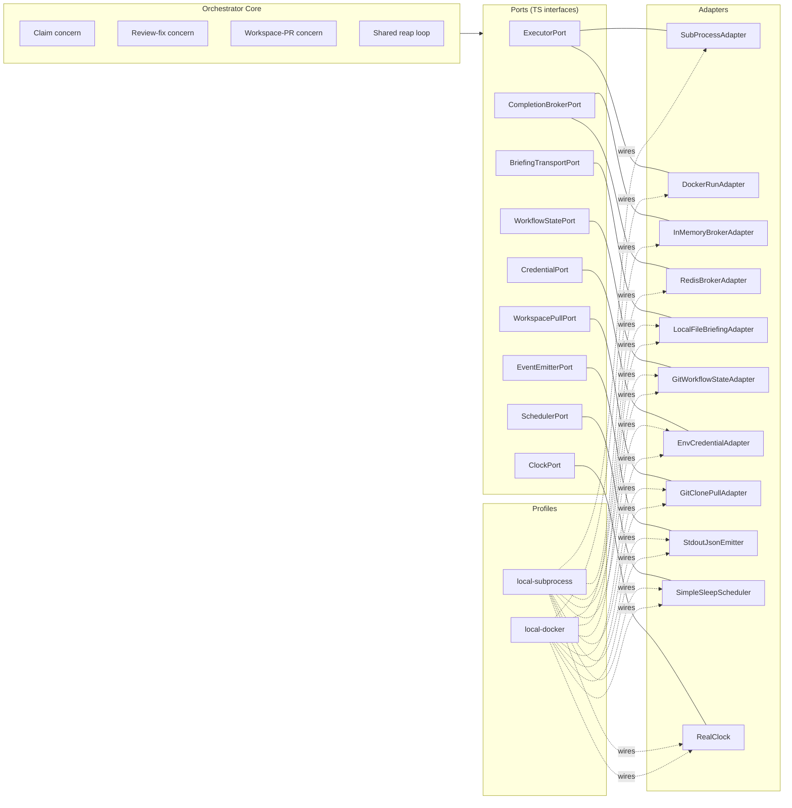

# Technical Design

## Feature
- Feature ID: `runtime-portable-architecture`
- Title: Portable runtime architecture — extract today's bundled orchestrator/executor into ports, adapters, and profiles

> Status: draft. Reflects the architectural direction agreed in
> `discussion-orchestrator-architecture.md`, scoped down to the
> architectural foundation only (no BYO executor, no customer-facing
> surface, no production adapters). The discussion doc remains the
> long-form reasoning record and includes the deferred BYO direction.

## Current State

Today's runtime is single-tenant, single-machine, and bundled:

- One Docker image contains both orchestrator (`runtime/orchestrator/`) and Claude executor (`runtime/executors/claude/`).
- A `docker compose up` starts one or more `agent-N` containers; each runs an orchestrator process.
- The orchestrator's claim cycle waits for the executor to finish a task before advancing: pull → eligibility → claim → spawn child → **await child exit** → dispatch result → sleep.
- Multiple agents run via multiple containers, coordinating only via git push race on GitHub.
- The `ExecutorAdapter` interface exists; `SubProcessAdapter` is its only implementation.
- Workflow state lives in the management git repo (one per workspace).

This architecture works for one team, one machine, one image. It does not support portable deployment, asynchronous concurrency, or any future feature that needs the orchestrator/executor seam to be more than a child-process boundary.

## Constraints

Lifted from the product spec:

1. **Workflow state remains in git.** No DB; no state migration.
2. **Same Claude executor image is used.** No second executor image is registered or run in this feature.
3. **Two profiles ship: `local-subprocess` and `local-docker`.** No production adapter in this feature.
4. **Orchestrator's cycle becomes asynchronous.** The blocking await-for-exit step is removed; results are reaped in a later cycle.
5. **Tenant context flows through orchestrator code paths.** Plumbed but not enforced.
6. **No customer-facing surface.** No registration, no conformance, no UI.
7. **HTTP callback transport ships in this feature.** Both local profiles use the same HTTP callback path the future production/BYO feature will use. Authentication ships as nonce-only (HMAC deferred — see D5).
8. **Shared completion broker ships in this feature.** Orchestrator runtime state (in-flight handles, completed-but-unreaped completions) lives in a shared broker reached over HTTP — embedded for `local-subprocess`, Redis-backed for `local-docker`. This is platform-internal runtime state, not workflow state; Constraint #1 (workflow state in git) is unaffected. See D7.

## Options Considered

### Decision D1 — Architectural pattern

#### Option D1a — Inline refactor (extend today's ExecutorAdapter)
Add new methods to `ExecutorAdapter` (`listCompleted`, `readResult`, `ack`); leave the rest of the runtime as-is. Lower upfront effort. Downside: the rest of the runtime stays coupled to inline assumptions (git in-process, stdout-only events, env-var-only credentials), so each future portability requirement is its own refactor.

#### Option D1b — Hexagonal / ports-and-adapters — **chosen**
Identify every place the orchestrator core touches the world (executor lifecycle, briefing transport, workflow state, credentials, image resolution, event emission, scheduling, time), promote each to a TypeScript port interface, and inject adapters at startup based on a named profile. Higher upfront effort; pays back the moment a second profile is added.

The discussion document covers the full reasoning. We are committing to D1b here.

### Decision D2 — Execution dispatch model

#### Option D2a — Keep the synchronous await (today)
`spawn()` then `await child.exit()`. Concurrency = pool size. Bursty load needs idle pods. Doesn't scale beyond a single machine.

#### Option D2b — Asynchronous submit + reap — **chosen**
The orchestrator calls `submit()` to dispatch a task, immediately stores the returned handle, and returns to its loop. A separate reap step in a later cycle calls `listCompleted()`, then `readResult()` on each completed handle, then `ack()`. The orchestrator's cycle never waits for any single executor to finish.

This is the substantive change in the runtime's behaviour. Pool size is decoupled from concurrent task count.

### Decision D3 — How completions are delivered

The async pattern still has to physically work for the bundled Claude executor in the local profiles. Three shapes considered:

#### Option D3a — Poll the runtime by label (orchestrator → executor)
Orchestrator periodically lists Docker containers labelled `platform=true` and checks which have exited. `readResult` reads the result file from a shared host volume.

Rejected. Three problems:
1. It assumes the runtime supports a label-filtered list-and-scan API. Docker and Kubernetes do; many other runtimes (queue-based workers, serverless functions, BYO customer-side runners) do not.
2. It assumes the set of "things tagged `platform=true`" is uniquely owned by *this* orchestrator. False on shared infra, on multi-orchestrator hosts, after a crash leaves orphans, when other tools also label things.
3. Its supposed virtue ("mirrors how production adapters discover completion") doesn't hold — most production runtimes give you a handle and you ask about it, not a label-filtered global scan.

#### Option D3b — Per-handle watch (orchestrator → executor)
Each `submit` registers a `docker wait` (or equivalent) on the spawned container; completions arrive as events the adapter pushes onto its completion buffer.

Better than D3a but still requires the orchestrator to be able to *reach into* the runtime to observe state. Fine for subprocess and local-docker, broken for any topology where the orchestrator cannot initiate contact with the executor's runtime — most notably pull-family customer runners (the deferred BYO direction).

#### Option D3c — Runner callback (executor → orchestrator) — **chosen**
Reverse the direction. At `submit` time the adapter passes the runner a callback target (an HTTP URL + per-handle nonce) alongside the briefing path. When the executor finishes, the *runner* (a small wrapper hosting the executor — see D6) POSTs the result and nonce back to a callback receiver, which validates the nonce and enqueues the completion. The orchestrator's reap loop drains completions later. The receiver lives in the **shared completion broker** (see D7), not in each orchestrator process.

The HTTP transport is used by **both** local profiles. The future production/BYO feature reuses the same receiver code path; it adds HMAC authentication (D5b) and a per-tenant addressing layer, not a new transport.

Why this is the right shape:
- **One direction works everywhere.** Subprocess, local-docker, future K8s, future queue-based workers, and future BYO customer runners all share the same property: they have outbound reach (loopback, host network, egress to a known endpoint). Even pull-family BYO runners — which by definition cannot accept inbound from us — can call us back outbound. This dissolves the push-vs-pull dichotomy at the completion-delivery layer.
- **No leaked discovery mechanism.** The port contract doesn't presume labels, scans, watches, or any specific runtime API.
- **One transport, exercised every dev cycle.** Both local profiles use the same HTTP receiver the production feature will use. There is no in-process special case for completion delivery; the production code path is exercised on every laptop run.
- **The executor image is unchanged.** The executor's contract remains "write `RESULT_PATH`, exit". The runner — not the executor — POSTs the result back (see D6).

### Decision D4 — Profile mechanism shape

#### Option D4a — Compile-time profile selection
A build-time flag determines which adapter set is wired. Smaller binary, less flexibility.

#### Option D4b — Runtime profile selection — **chosen**
A `--profile` argument or `agent.yaml` field selects from a registered profile catalogue at startup. One binary supports every profile. Per-port overrides are also runtime-selectable, useful for surgical debug ("run with `local-docker` but emit events to stdout").

### Decision D5 — Callback authentication

The broker's HTTP receiver must reject unauthorized callbacks (otherwise any process with network reach could push fake completions onto the queue). Two postures considered:

#### Option D5a — Per-handle nonce only — **chosen for this feature**
At `submit`, the orchestrator generates a random per-handle nonce and registers `(handle, nonce, kind, …)` with the broker. The runner is given the nonce via env; on completion it echoes the nonce in the POST. The broker rejects unknown nonces and replays (a nonce is invalidated as soon as its handle is acked). Sufficient for the local profiles where traffic is loopback or a trusted dev bridge.

#### Option D5b — Per-handle nonce + HMAC-signed body — **deferred to production/BYO**
Same nonce mechanism plus the runner signs the request body with a per-tenant secret; broker validates the signature. Necessary when traffic crosses untrusted intermediaries (the production/BYO topology). Out of scope here — the broker is structured so HMAC validation is a drop-in middleware in the production feature, not a rewrite. The deferred-work note for that feature should call this out explicitly.

### Decision D6 — Runner shape (how the executor posts back)

The Claude executor image's contract is "write `RESULT_PATH`, exit". For the runner inside the container (or process tree) to POST the result, something has to wrap the executor invocation. Three ways:

#### Option D6a — Bake a wrapper into the executor image
Changes the executor's contract; couples the image to the platform's callback protocol. Rejected — the executor team owns the image and shouldn't be forced to follow platform-internal protocol changes there.

#### Option D6b — Sidecar / init-container
Adds a second container per task. Heavyweight for local profiles. Rejected.

#### Option D6c — Mount a wrapper at runtime; override the entrypoint — **chosen**
The orchestrator mounts a tiny platform-owned wrapper script (`runner.sh` or `runner.ts`) into the runner's process tree and runs it as the entrypoint. The wrapper exec's the bundled executor binary, then on exit reads `RESULT_PATH` and POSTs `{ handle, nonce, result }` to the broker's HTTP receiver (D7). The executor image stays unchanged; the wrapper is a platform-side artifact.

The same wrapper script works in both profiles — only the spawn mechanism differs (`fork` for subprocess, `docker run` for docker) and the `$CALLBACK_URL` env var (broker's address, profile-specific).

### Decision D7 — Where in-flight orchestrator state lives

The runner needs to call back somewhere; the orchestrator needs to drain completions from somewhere. Where does that "somewhere" live?

#### Option D7a — Per-orchestrator in-process buffer
Each orchestrator process owns its own completion buffer and HTTP receiver. The runner POSTs to the orchestrator that submitted it; that orchestrator drains its own buffer.

Rejected. The runner must address one specific orchestrator (per-orchestrator URL or hostname). If the submitting orchestrator dies before its runner POSTs, the callback fails and recovery is via task-YAML reconciliation + runtime-specific lookup (`docker inspect`, etc.). It also forces tasks to be owned end-to-end by the orchestrator that claimed them, preventing any natural rebalancing of dispatch work across the pool.

Conceptually, this conflates **workflow state** (which is correctly per-task and per-claim) with **orchestrator runtime state** (which has no reason to be per-orchestrator). They're different categories.

#### Option D7b — Shared completion broker — **chosen**
A separate component (`CompletionBroker`) owns the in-flight handle registry and the completion queue. Orchestrators register handles with the broker at `submit` time, runners POST completions to the broker, and any orchestrator drains the broker via a peek-and-lock API. Properties:

- **Runner addressing dissolves.** Runners POST to one URL — the broker's. They don't know or care which orchestrator submitted. T-Q7 (the per-orchestrator addressing question) ceases to exist.
- **Submit and reap decouple.** Any orchestrator can drain any completion. Workload balances naturally; tasks are no longer "owned end-to-end" — dispatch is opportunistic.
- **Crashes are no longer special.** If the submitting orchestrator dies, its pending completion sits in the broker until another orchestrator drains it. No `docker inspect` reconciliation, no in-flight YAML sweep for orchestrator-runtime-state recovery.
- **It's the production architecture.** Every distributed task system works this way (SQS visibility-timeout, RabbitMQ unacked messages, Redis Streams consumer groups). Designing without it now would force a refactor in BYO.

The pattern is peek-and-lock: a peek returns the next completion and atomically marks it locked-by-caller for a visibility timeout. Ack commits the consumption; nack returns it to the queue. Visibility-timeout reclaim handles orchestrators that lock-then-die.

The broker is **platform-internal runtime state**, not workflow state. Constraint #1 (workflow state in git) governs the latter, not the former. Putting orchestrator runtime state in a shared store (Redis or in-memory, depending on profile) does not violate the constraint.

The broker is a port: `CompletionBrokerPort`. Adapters:
- `InMemoryBrokerAdapter` — embedded in the orchestrator process for `local-subprocess`. Single-process topology; no Redis. Same code path on the orchestrator side as the Redis-backed adapter; only the storage layer differs.
- `RedisBrokerAdapter` — separate broker service backed by Redis for `local-docker` and beyond. Multiple orchestrators share one broker.

Either adapter exposes the same HTTP API to runners and the same interface to orchestrators.

## Chosen Design

### Architectural pattern: hexagonal (ports + adapters)

The orchestrator core depends only on a fixed set of TypeScript interfaces ("ports"). Concrete implementations ("adapters") are wired into those ports at startup based on a named "profile". The same orchestrator binary runs in every profile; only the adapter set differs.

See `discussion-orchestrator-architecture.md` Appendix A for the full reasoning, port-level table, and profile compositions. See Appendix B in that document for the system diagram.

### The ports

The orchestrator core depends on these interfaces. Each has at least one adapter implementation in this feature.

| Port | Purpose |
|---|---|
| `ExecutorPort` | Spawn an executor: `submit` (returns immediately), `readResult`. Completion delivery is on `CompletionBrokerPort`. |
| `CompletionBrokerPort` | In-flight handle registry + completion queue. `register`, `listCompleted` (peek-and-lock), `ack`, `nack`. Backed by an embedded in-memory adapter or by Redis. |
| `BriefingTransportPort` | Deliver briefing.md to the executor. |
| `WorkflowStatePort` | Read/write task YAML, append logs. Backed by git in every profile. |
| `CredentialPort` | Provide credentials to the executor. In this feature: pass-through from env vars. |
| `WorkspacePullPort` | Materialize the customer's workspace repo for the orchestrator's use. |
| `EventEmitterPort` | Emit structured events / metrics. |
| `SchedulerPort` | Cycle cadence. |
| `ClockPort` | Time, sleep, deadlines (mocked in tests). |

`ImageResolverPort` is **deferred** to the BYO feature — in this feature there is only one image (the Claude executor) so resolution is trivially static.

### The `ExecutorPort` contract

```ts
interface ExecutorPort {
  /** Spawn the executor for a previously-registered handle. Returns
   *  immediately — does NOT wait for the executor to finish. */
  submit(input: ExecutorInput): Promise<ExecutorHandle>;

  /** Optional: read a result the broker only stored a pointer to
   *  (e.g. an S3 key). For local profiles where the result rides in
   *  the callback payload, this is a no-op. */
  readResult(handle: ExecutorHandle): Promise<ExecutorResult>;
}
```

The orchestrator's claim and review-fix concerns depend on this small surface. **`submit` is non-blocking** — it returns as soon as the runner is spawned. Completion delivery and queue draining live on `CompletionBrokerPort` (below); the executor adapter doesn't track in-flight state.

`ExecutorInput` carries the broker's HTTP callback URL and the per-handle nonce; the adapter passes both to the runner via env vars at spawn time. The runner POSTs `{ handle, nonce, result }` to the broker on completion.

### The `CompletionBrokerPort` contract

```ts
interface CompletionBrokerPort {
  /** Register a handle as in-flight before submit. The broker stores
   *  the nonce and metadata for callback validation and routing. */
  register(handle: ExecutorHandle, nonce: string, metadata: HandleMetadata): Promise<void>;

  /** Peek and lock up to N completions. Atomically marks them
   *  locked-by-caller for the visibility timeout. */
  listCompleted(opts?: { max?: number; lockMs?: number }): Promise<ExecutorCompletion[]>;

  /** Commit the consumption of a completion. Invalidates the nonce
   *  and removes the handle from the in-flight registry. */
  ack(handle: ExecutorHandle): Promise<void>;

  /** Return a locked completion to the queue (e.g. on graceful
   *  shutdown before the orchestrator could dispatch). */
  nack(handle: ExecutorHandle): Promise<void>;
}
```

The broker also exposes an HTTP route runners POST to: `POST /callback` with `{ handle, nonce, result }`. Validates the nonce against the in-flight registry, enqueues the completion. The orchestrator never sees this route; it's the broker's surface to runners.

`HandleMetadata` carries `kind` (`impl` | `review-fix`), `subkind` (where applicable), `task_id`, and any other context the dispatching orchestrator needs to act on the completion without prior knowledge of the submit. Self-contained handles → opportunistic dispatch.

### The three workflow concerns

The orchestrator pool runs three concerns:

1. **Claim concern.** Polls workspace repos, claims eligible tasks via git push race, registers the handle with the broker (`CompletionBrokerPort.register`), calls `ExecutorPort.submit()` to spawn the runner, records the handle on the task YAML, returns. **Spawns one executor per claim, but does not wait for it.**
2. **Review-fix concern.** Polls in-review PRs. For tier-1 conflicts, registers + submits a `subkind=rebase` handle. For unresolved review threads, registers + submits a `subkind=respond` handle. Same non-blocking flow as claim.
3. **Workspace-PR lifecycle concern.** Pure git/API operations: open the management-repo PR at claim time, merge it when the impl PR merges, recover stuck PRs. Never spawns an executor.

A **shared reap loop** alongside the concerns calls `CompletionBrokerPort.listCompleted()` to peek-and-lock completions from the broker, routes each completion by its handle's `kind` (`impl` → claim concern's dispatcher; `review-fix` → review-fix dispatcher), reads the result (inline if present; via `ExecutorPort.readResult` if only a pointer was stored), dispatches side-effects, and acks the handle. Any orchestrator can drain any completion — dispatch is opportunistic, not pinned to the submitter.

### Profiles shipped in this feature

| Profile | `ExecutorPort` adapter | `CompletionBrokerPort` adapter | Purpose |
|---|---|---|---|
| `local-subprocess` | `SubProcessAdapter` | `InMemoryBrokerAdapter` (embedded) | Bundled image, single orchestrator process. `register` + `submit` happen in the same process; the broker's HTTP receiver is a route on the embedded broker. `submit` spawns the **runner wrapper** (D6c) as a child with env vars (`BRIEFING_PATH`, `RESULT_PATH`, `CALLBACK_URL=http://127.0.0.1:<broker_port>/callback`, `HANDLE`, `NONCE`). The wrapper exec's the executor; on exit it POSTs to the broker over loopback. `listCompleted` peek-and-locks; `ack` commits. |
| `local-docker` | `DockerRunAdapter` | `RedisBrokerAdapter` (separate broker service) | M:N profile. Orchestrator containers, Claude executor containers (one per task), and **one broker container** all share a docker-compose bridge network. `submit` does `docker run` of the Claude executor image with the runner wrapper (D6c) as entrypoint, on the shared bridge, with `CALLBACK_URL=http://broker:<port>/callback`. The wrapper POSTs to the broker on exit. Any orchestrator drains via `listCompleted`. `ack` runs `docker rm`. |

Both profiles use the same orchestrator binary and the same executor image. They differ only in the executor adapter (subprocess vs docker run) and the broker adapter (embedded vs Redis-backed).

The runner wrapper is **identical** in both profiles — only the `$CALLBACK_URL` env var changes, and that's set by the orchestrator at submit time.

A wrapper-crash safety net runs alongside the broker callback: `child.on('exit')` (subprocess) or `docker wait` (docker) detects when the runner exits without a corresponding callback arriving at the broker within a grace window. The adapter then issues a synthetic `failed` completion via the broker's callback route on the runner's behalf — same code path, just sourced from the orchestrator instead of the runner. HTTP is the primary mechanism; exit observation is the safety net.

### How `submit` works per profile

Concrete walk-through of the spawn flow per profile, plus the production targets the same code path will support. The orchestrator-side `submit` flow has four pieces:

1. **Generate identifiers.** A new `handle` and a per-handle `nonce` (random 256-bit, single-use).
2. **Register with the broker.** `await broker.register(handle, nonce, metadata)` where `metadata` carries `kind` / `subkind` / `task_id` / `feature_id` / `tenant_id` / `started_at`.
3. **Spawn the runner.** Profile-specific — see below. This is the only step that varies.
4. **Return** the handle to the caller (the claim or review-fix concern). The concern then writes the handle to the task YAML.

The runner does the rest — exec the executor binary, read `RESULT_PATH` on exit, POST `{ handle, nonce, result }` to `$CALLBACK_URL`. Identical across all profiles.

#### `local-subprocess` — `child_process.spawn`

Step 3:

```
spawn('/platform/runner.js', [], {
  env: {
    BRIEFING_PATH: '/workspaces/<task>/briefing.md',
    RESULT_PATH:   '/workspaces/<task>/result.json',
    CALLBACK_URL:  'http://127.0.0.1:<broker_port>/callback',
    HANDLE:        handle,
    NONCE:         nonce,
  }
})
```

The broker's `<broker_port>` was bound at orchestrator startup (T-Q10). The wrapper POSTs to it over loopback. `child.on('exit')` is the wrapper-crash safety net; the adapter records `(handle, pid, started_at, nonce)` in its supervision map for that purpose.

#### `local-docker` — `docker run -d`

Step 3:

```
docker run -d \
  --name exec-<handle> \
  --network agents-net \                              # shared bridge
  --entrypoint /platform/runner.js \                  # D6c wrapper
  --restart=no \
  -v /platform-bin:/platform:ro \                     # mount wrapper
  -v /workspaces/<task>:/workspace:rw \               # briefing in / result out
  -e BRIEFING_PATH=/workspace/briefing.md \
  -e RESULT_PATH=/workspace/result.json \
  -e CALLBACK_URL=http://broker:7000/callback \       # broker service name
  -e HANDLE=$handle \
  -e NONCE=$nonce \
  --label platform.handle=$handle \                   # forensics only
  executor:current
```

The container runs the wrapper as PID 1; when the wrapper exits (after POSTing) the container exits naturally. `docker wait` runs as the wrapper-crash safety net.

**Why no `--rm`:** the container must persist between exit and `ack` so that:
- `docker logs` and `docker inspect` remain available for forensics during dispatch.
- The wrapper-crash safety net can read the exit code and stderr to construct a synthetic `failed` completion if the wrapper died before POSTing.
- A briefly unreachable broker doesn't cause Docker to GC the container while the wrapper is still retrying.

**Why `--restart=no`:** Docker must never silently restart a crashed wrapper — a restarted container would re-POST with the same nonce, which the broker has already invalidated. Recovery is a platform concern, never Docker's.

**Cleanup.** `DockerRunAdapter.ack(handle)` runs `docker rm <container_id>` and unlinks the result file. The container leaves `docker ps -a` only after the orchestrator has dispatched the completion.

**Orphan sweep.** If `ack` never happens (e.g. broker lost after enqueue, no orchestrator drains), exited containers accumulate. A periodic sweep scans `docker ps -a -f label=platform.handle=*` for containers older than a threshold with no corresponding in-flight broker entry and removes them. Belongs in Wave 4 alongside the safety net.

#### Production — push family (e.g. K8s Job) — *deferred to BYO*

Step 3 becomes a Job apply:

```
apply Job manifest:
  image:                    <tenant_image>          # from ImageResolverPort
  command:                  /platform/runner.js
  env:                      BRIEFING_PATH, RESULT_PATH, CALLBACK_URL,
                            HANDLE, NONCE
  volumes:                  briefing (ConfigMap | PVC), result PVC, runner volume
  restartPolicy:            Never
  ttlSecondsAfterFinished:  <safety net for orphan Jobs>
  labels:                   platform.handle, platform.tenant
```

Same lifecycle as local-docker: pod runs to completion, exits naturally; Job persists for forensics; deleted at `ack` (or after TTL as a safety net). HMAC middleware (D5b) and per-tenant routing live at the broker's edge — `submit` itself is unchanged.

#### Production — pull family (queue + customer runner agent) — *deferred to BYO*

`submit` does **not** spawn anything. Step 3 enqueues:

```
await workQueue.enqueue(tenant_id, {
  handle,
  nonce,
  briefing_url:  '<signed URL the runner fetches>',
  callback_url:  'https://broker.platform/callback',
  deadline:       now() + maxRunMs,
})
```

The customer's runner agent — running in their VPC with outbound-only network access — long-polls the queue, picks up the message, fetches the briefing via the signed URL, exec's their executor with the same env contract, and on exit POSTs to `callback_url` with `{ handle, nonce, result }`. Identical callback path to all other profiles.

There is no orchestrator-side runner supervision; the safety net is the broker's visibility timeout plus a per-handle deadline sweep.

#### Summary across deployments

| Concern | `local-subprocess` | `local-docker` | Prod push (K8s) | Prod pull (queue) |
|---|---|---|---|---|
| `register` (broker) | embedded broker | Redis broker | Redis / managed broker | Redis / managed broker |
| `submit` mechanism | `child_process.spawn` | `docker run -d` | `kubectl apply` (Job) | `queue.publish` |
| Where runner runs | orchestrator's host | spawned container | tenant K8s namespace | customer VPC |
| `CALLBACK_URL` | `127.0.0.1:<broker_port>` | `broker:7000` (bridge DNS) | `broker.platform/callback` | `broker.platform/callback` |
| Auth | nonce | nonce | nonce + HMAC (D5b) | nonce + HMAC (D5b) |
| Wrapper-crash safety net | `child.on('exit')` | `docker wait` | K8s Job watch | broker visibility timeout + deadline sweep |
| Cleanup at `ack` | unlink result file | `docker rm` + unlink | delete Job (or rely on TTL) | broker entry only |
| Reap | broker peek+lock | broker peek+lock | broker peek+lock | broker peek+lock |

Steps 1–2 (handle + nonce + broker register), step 4 (return), and the runner-side callback are identical across all four deployments. Only step 3 — how the runner is launched — varies.

### Loop topology

Day 1: one sequential cycle inside an orchestrator process — claim concern, then review-fix, then workspace-PR-lifecycle, then sleep. Mirrors today's `agent-loop.ts`. Splits into independent concurrent loops only when measured cadence needs diverge. Detail in `discussion-orchestrator-architecture.md`.

### Workflow state pattern

Git remains authoritative. The `WorkflowStatePort` adapter clones each workspace repo, reads/writes task YAMLs, commits and pushes. Behaviourally identical to today.

### Completion broker

Per Decisions D3c and D7b, completion delivery and orchestrator runtime state live in a shared broker. The broker exposes:

**Runner-facing surface (HTTP)**:
- `POST /callback` — body: `{ handle, nonce, result }`. Validates the nonce against the in-flight registry, enqueues the completion on success, returns 204. On unknown / replayed nonce, returns 401 and emits an event.

**Orchestrator-facing interface (`CompletionBrokerPort`)**:
- `register(handle, nonce, metadata)` — called at submit time; broker stores `(handle, nonce, kind, …)` until ack.
- `listCompleted({ max, lockMs })` — peek-and-lock semantics. Returns up to `max` completed items, atomically marking each as locked-by-caller for `lockMs`. If a locked item isn't acked within the visibility timeout, it returns to the queue (the broker's reclaim sweep handles this).
- `ack(handle)` — commits the consumption; invalidates the nonce; removes the handle from in-flight.
- `nack(handle)` — returns a locked item to the queue immediately (used during graceful shutdown).

**Adapters**:
- `InMemoryBrokerAdapter` — embedded in the orchestrator process for `local-subprocess`. The HTTP receiver is a route on the same Node server the orchestrator already runs. State is a `Map<handle, registryEntry>` plus a queue of completed-not-yet-locked items. Single-process; no Redis.
- `RedisBrokerAdapter` — implemented as a separate broker service (small Node process exposing the HTTP surface) backed by Redis Streams + consumer groups. Multiple orchestrators share this one broker.

**Why this is right for both profiles**:
- The orchestrator code is identical in both profiles — it calls `CompletionBrokerPort.register/listCompleted/ack`. The fact that the broker is embedded in subprocess and shared in docker is invisible to the core.
- The runner code is identical — POSTs `{ handle, nonce, result }` to `$CALLBACK_URL`. The URL is wherever the broker lives, set at submit time.
- The production/BYO feature reuses the broker contract verbatim. It adds HMAC middleware (D5b), multi-tenant partitioning, and production-grade Redis (HA, persistence, eviction). Not a new transport.

**What the broker is not**:
- Not workflow state. Workflow state is in git per Constraint #1; the broker holds platform-internal runtime state — in-flight handles and their pending completions. If the broker's data is lost, the workflow lifecycle is intact in git; in-flight executions need to be reconciled (covered below).
- Not a message bus for arbitrary events. It carries one message type: completion records keyed by handle.
- Not durable across catastrophic loss. For local-subprocess the broker dies with the orchestrator (acceptable — single process, single failure domain). For local-docker, Redis is configured with AOF/RDB by default but multi-AZ HA is a production-only concern.

### Tenant-context plumbing

Every port method takes a `tenant_id` parameter (or carries it via context object). In this feature the value is always the same single tenant — but the call-site shape is now ready for the future multi-tenant feature to add real values without modifying every call site.

The exact extent of plumbing depends on the answer to product-spec B2.

## Orchestrator runtime architecture

This section consolidates how an orchestrator process is structured at runtime, and how multiple orchestrator processes coexist. The hexagonal pattern (D1b), the runner-callback model (D3c), and the shared broker (D7b) leave several runtime questions implicit; this section makes them explicit.

### Inside one orchestrator process

An orchestrator is a single Node.js process running a sequential cycle (Shape A from the discussion doc):

1. **Claim concern** — polls workspaces, claims tasks via the git push race, calls `register` + `submit`.
2. **Review-fix concern** — polls in-review PRs, calls `register` + `submit` for rebase / respond-to-review work.
3. **Workspace-PR lifecycle concern** — pure git/API work; no executor.
4. **Shared reap loop** — calls `CompletionBrokerPort.listCompleted()` (peek-and-lock), routes results by `handle.kind`, calls `readResult` if needed, dispatches side-effects, calls `ack`.

The cycle is single-threaded (Node event loop). Concerns and the reap loop run sequentially within one cycle and yield at `await` points. This mirrors today's `agent-loop.ts`.

The orchestrator process is **stateless with respect to in-flight execution state**. It holds no completion buffer, no in-flight registry, no callback receiver. All of that lives in the broker.

For `local-subprocess`, the broker is embedded in the orchestrator process (`InMemoryBrokerAdapter`) — same Node process, same HTTP server, but conceptually a separate component reachable via the broker port. The runner POSTs to the broker over loopback. For `local-docker`, the broker is a separate service.

What the orchestrator *does* hold in process:
- A small **runner-supervision map** for the wrapper-crash safety net — for each running child / container, the start time and a handle to detect abnormal exit. This is purely local rescue logic, not in-flight state.

#### Wrapper-crash safety net

The runner wrapper (D6c) does the broker POST. If the wrapper crashes (kill -9, OOM, segfault) before it can POST, the callback never arrives. To avoid leaking a hung handle:

- `SubProcessAdapter` keeps `child.on('exit')` as a local observer. If the child exits without a corresponding completion arriving at the broker within a grace window, the adapter issues a synthetic `failed` completion via the broker's callback route on the runner's behalf — same payload shape, just sourced from the orchestrator.
- `DockerRunAdapter` does the same with `docker wait`.

This makes the broker callback the primary mechanism and the runtime-side exit observation the safety net.

### Multiple orchestrator processes

Multiple orchestrator processes run as **peers**, sharing one broker. There is no leader election; no per-orchestrator HTTP receiver; no per-orchestrator in-flight state.

- All orchestrators register handles with the same broker.
- All runners POST to the same broker URL — they don't address a specific orchestrator.
- Any orchestrator can drain any completion via `listCompleted` (peek-and-lock); the broker hands each completion to exactly one orchestrator at a time. Workload balances naturally.
- Workflow-level coordination — *who claims a task* — happens via the git push race on the management repo, exactly as today. The broker is for runtime state only; the claim race is for workflow state.

#### Dispatch is opportunistic, not pinned

A single task may be claimed by orchestrator A, submitted by A, completed by the runner, and **dispatched by orchestrator B** (because B happened to call `listCompleted` first). This is fine — the handle metadata carries everything B needs to dispatch (task_id, kind, subkind, target repo). No orchestrator-to-orchestrator handoff is required.

This is the substantive simplification over per-orchestrator buffers: **submit and reap are decoupled**. The orchestrator that submitted is no longer privileged in dispatch.

### Failure modes

**Submitting orchestrator dies before the runner POSTs.**
- The runner POSTs to the broker (not to the dead orchestrator). The broker enqueues normally.
- Any surviving orchestrator drains the completion on the next cycle.
- No `docker inspect` reconciliation, no task-YAML in-flight sweep for runtime state.

**Orchestrator locks a completion (calls `listCompleted`) and dies before acking.**
- The visibility timeout expires; the broker returns the item to the queue.
- Another orchestrator picks it up.

**Broker dies (local-docker).**
- Runners that try to POST get connection-refused; they retry with backoff. (For Redis-backed broker, restart restores state from AOF/RDB.)
- If the broker is permanently lost, in-flight handles become stuck. Recovery is a manual sweep: scan task YAMLs for `in_progress` tasks whose handle the (now-recovered) broker doesn't know about; for each, query the runtime (`docker ps`, `docker inspect`) to find still-running containers and re-register them — this is the rare-edge-case reconciliation path.
- For `local-subprocess`, broker death = orchestrator death; same single failure domain.

**Runner can't reach the broker.**
- Runner retries with bounded backoff. If it gives up, the wrapper-crash safety net fires (the orchestrator's exit observer issues a synthetic `failed` completion).

### What's deferred to production / BYO

The broker, the HTTP transport, and the wrapper-crash safety net all ship in this feature. What remains for the production/BYO feature:

- **HMAC-signed callbacks (D5b).** Drop-in middleware on the broker's POST route. Required before the broker is reachable across an untrusted network.
- **Multi-tenant broker partitioning.** Per-tenant in-flight isolation; per-tenant secrets; tenant identification from the request.
- **Production-grade broker.** Redis HA, persistence config, eviction policy, capacity sizing, monitoring. The local-docker broker is a single Redis instance — fine for dev, not for production.
- **Pull-family runners.** Runner agents in customer infra that long-poll the broker for work and POST back outbound. The broker's existing surface already supports this.
- **Cross-cluster broker federation.** When orchestrators span regions/clusters and a single broker is no longer appropriate.

## Architecture diagrams

### Hexagon view — orchestrator core surrounded by ports

```
                          ┌─────────────────────────┐
                          │     SchedulerPort       │
                          │   (cycle cadence)       │
                          └───────────┬─────────────┘
                                      │
   ┌─────────────────────┐       ╱─────────╲       ┌─────────────────────┐
   │     ClockPort       │──────╱           ╲──────│   EventEmitterPort  │
   │   (time, sleep)     │     ╱             ╲     │  (events / metrics) │
   └─────────────────────┘    ╱               ╲    └─────────────────────┘
                             ╱                 ╲
   ┌─────────────────────┐  ╱   ORCHESTRATOR    ╲  ┌─────────────────────┐
   │ BriefingTransport   │ ╱        CORE         ╲ │  WorkflowStatePort  │
   │   Port              │─                      ─│  (task YAML / git)  │
   │ (deliver briefing)  │ ╲   • claim concern   ╱ └─────────────────────┘
   └─────────────────────┘  ╲  • review-fix     ╱
                             ╲ • workspace-PR  ╱
   ┌─────────────────────┐    ╲• shared reap  ╱    ┌─────────────────────┐
   │   CredentialPort    │     ╲             ╱     │  WorkspacePullPort  │
   │ (creds → executor)  │──────╲           ╱──────│  (clone workspace)  │
   └─────────────────────┘       ╲─────────╱       └─────────────────────┘
                                  │       │
                  ┌───────────────┘       └───────────────┐
                  │                                        │
       ┌──────────┴──────────────┐         ┌──────────────┴────────────────┐
       │     ExecutorPort        │         │   CompletionBrokerPort        │
       │  submit · readResult    │         │  register · listCompleted     │
       │  (spawn the runner)     │         │  (peek+lock) · ack · nack     │
       └─────────────────────────┘         └───────────────────────────────┘

      ── core depends ONLY on port interfaces; never on a concrete adapter ──
      ── ExecutorPort spawns; CompletionBrokerPort delivers completions   ──
```

### Layered view — how a profile wires adapters into ports

```
   ┌─────────────────────────────────────────────────────────────────┐
   │  PROFILE  (selected at startup via --profile or agent.yaml)     │
   │     local-subprocess                local-docker                │
   └──────────────────┬──────────────────────────┬───────────────────┘
                      │ injects                  │ injects
                      ▼                          ▼
   ┌─────────────────────────────────────────────────────────────────┐
   │  ADAPTERS                                                       │
   │   ExecutorPort         → SubProcessAdapter  | DockerRunAdapter  │
   │   CompletionBroker     → InMemoryBrokerAdapter | RedisBrokerAdapter │
   │   BriefingTransport    → LocalFileBriefingAdapter               │
   │   WorkflowState        → GitWorkflowStateAdapter                │
   │   Credential           → EnvCredentialAdapter                   │
   │   WorkspacePull        → GitClonePullAdapter                    │
   │   EventEmitter         → StdoutJsonEmitter                      │
   │   Scheduler            → SimpleSleepScheduler                   │
   │   Clock                → RealClock                              │
   └─────────────────────────────────┬───────────────────────────────┘
                                     │ implement
                                     ▼
   ┌─────────────────────────────────────────────────────────────────┐
   │  PORTS  (TypeScript interfaces — the only thing core sees)      │
   └─────────────────────────────────┬───────────────────────────────┘
                                     │ depended on by
                                     ▼
   ┌─────────────────────────────────────────────────────────────────┐
   │  ORCHESTRATOR CORE                                              │
   │    Claim · Review-fix · Workspace-PR · Shared reap loop         │
   └─────────────────────────────────────────────────────────────────┘
```

### Async submit/reap flow through the broker

```
     ┌────────────────────┐          ┌─────────────────────┐
     │  Claim concern     │          │  Review-fix concern │
     └─────────┬──────────┘          └──────────┬──────────┘
               │ 1. broker.register(handle, nonce, metadata)
               │ 2. executor.submit(briefing_path, CALLBACK_URL, nonce)
               ▼                                 ▼
     ╔═════════════════════════════════════════════════════╗
     ║                  ExecutorPort                       ║
     ║   submit ─► spawns runner; returns immediately      ║
     ╚═════════════════════════════════════════════════════╝
                              │ spawn with env vars
                              ▼
                  ┌──────────────────────────┐
                  │  Runner wrapper (D6c)    │
                  │  • exec executor binary  │
                  │  • on exit: read RESULT, │
                  │    POST {handle, nonce,  │
                  │    result} to            │
                  │    $CALLBACK_URL         │
                  └────────────┬─────────────┘
                               │ HTTP POST to broker
                               ▼
   ╔═══════════════════════════════════════════════════════════════════╗
   ║                       COMPLETION BROKER                          ║
   ║                                                                  ║
   ║   POST /callback (runner-facing)                                 ║
   ║      • validate nonce against in-flight registry                 ║
   ║      • on valid → enqueue completion (204)                       ║
   ║      • on invalid → emit event, return 401                       ║
   ║                                                                  ║
   ║   In-flight registry  (handle, nonce, kind, …)                   ║
   ║   Completion queue    (peek-and-lock with visibility timeout)    ║
   ║                                                                  ║
   ║   InMemoryBrokerAdapter (local-subprocess)                       ║
   ║   RedisBrokerAdapter    (local-docker, production)               ║
   ╚═══════════════════════════════════════════════════════════════════╝
                              ▲ peek-and-lock           │
                              │                          │ ack/nack
               ┌──────────────┴────────────────────┐    │
               │       Shared reap loop            │────┘
               │  broker.listCompleted({lockMs})   │
               │  routes by handle.kind →          │
               │   claim / review-fix dispatch     │
               │  ExecutorPort.readResult(h)?      │
               │  broker.ack(h)                    │
               └───────────────────────────────────┘

   Wrapper-crash safety net: if the wrapper exits without POSTing
   within a grace window, the adapter's exit-observation
   (child.on('exit') / docker wait) issues a synthetic 'failed'
   completion to the broker on the runner's behalf. Same code path.

   Visibility-timeout reclaim: if an orchestrator locks a completion
   and never acks (e.g. dies mid-dispatch), the broker returns the
   item to the queue after lockMs. Another orchestrator drains it.

   Any orchestrator can drain any completion. Dispatch is opportunistic.
```

### Inside one orchestrator process

```
   ┌────────────────────────────────────────────────────────────────────┐
   │  ONE ORCHESTRATOR PROCESS  (single Node event loop)                │
   │  — stateless w.r.t. in-flight execution state —                    │
   │                                                                    │
   │  ┌──────────────┐ ┌──────────────┐ ┌──────────────┐ ┌────────────┐ │
   │  │ Claim         │ │ Review-fix   │ │ Workspace-PR │ │ Shared      │ │
   │  │ concern       │ │ concern       │ │ concern      │ │ reap loop   │ │
   │  └──────┬───────┘ └──────┬───────┘ └──────────────┘ └─────┬──────┘ │
   │         │  register +       │  register +                   │       │
   │         │  submit           │  submit                       │       │
   │         ▼                    ▼                                ▼      │
   │   ┌────────────────────┐                ┌──────────────────────┐    │
   │   │ ExecutorPort        │                │ CompletionBrokerPort │    │
   │   │  • SubProcess       │                │  • InMemory (subproc)│    │
   │   │  • DockerRun        │                │  • Redis    (docker) │    │
   │   └─────────┬──────────┘                └──────────────────────┘    │
   │             │ spawn                              ▲    ▲  ▲           │
   │             │                                    │    │  │           │
   │             │                       register ───┘    │  │ peek/ack  │
   │             │                                         │  │           │
   │             │  ┌──────────────────────────────────────┘  │           │
   │             │  │ wrapper-crash safety net: if child       │           │
   │             │  │ exits w/o broker callback in grace        │           │
   │             │  │ window, post synthetic 'failed' to        │           │
   │             │  │ broker on runner's behalf                  │           │
   │             ▼  │                                            │           │
   │       ┌──────────────────────┐                              │           │
   │       │ runner-supervision    │                              │           │
   │       │ map (PID/container_id │                              │           │
   │       │ → start_time, nonce)  │                              │           │
   │       │ — local rescue logic  │                              │           │
   │       │   only; NOT in-flight │                              │           │
   │       │   state               │                              │           │
   │       └──────────────────────┘                              │           │
   └─────────────┼────────────────────────────────────────────────┼─────────┘
                  │ spawn                                         │
                  ▼                                                │
            ┌─────────────────┐                                    │
            │ Runner wrapper   │─── HTTP POST {handle, nonce, ───┘
            │ (D6c) — child    │      result} to broker
            │ or container     │
            │ entrypoint        │
            └─────────────────┘

   For local-subprocess, the broker is embedded in this same process
   (same Node server, separate route). Logically, it's still a separate
   component reached via the broker port.

   The other ports (BriefingTransport, WorkflowState, Credential,
   WorkspacePull, EventEmitter, Scheduler, Clock) are omitted from
   this view. See the hexagon view for the full port set.
```

### Multiple orchestrator processes — broker-mediated topology (`local-docker`)

```
                    ╔════════════════════════════════════╗
                    ║       COMPLETION BROKER             ║
                    ║       http://broker:7000            ║
                    ║                                      ║
                    ║   • In-flight registry              ║
                    ║   • Completion queue (peek+lock)    ║
                    ║   • Backed by Redis                  ║
                    ╚════════╤═════════╤═════════╤════════╝
                              │ register │ peek    │ ack
                              │          │ +lock   │
            ┌─────────────────┴──┐    ┌──┴──────┐  │
            │                     │    │          │  │
   ┌────────┴───────┐  ┌──────────┴──┐  ┌─────────┴──────┐
   │ Orchestrator A  │  │ Orchestrator B │  │ Orchestrator C │
   │ (no in-flight   │  │ (no in-flight  │  │ (no in-flight  │
   │  state of own)  │  │  state of own) │  │  state of own) │
   └────────┬───────┘  └──────────┬──┘  └────────┬─────────┘
            │ spawn                │ spawn         │ spawn
            ▼                      ▼               ▼
       ┌─────────┐            ┌─────────┐     ┌─────────┐
       │ runner  │            │ runner  │     │ runner  │
       │ for T1  │            │ for T2  │     │ for T3  │
       └────┬────┘            └────┬────┘     └────┬────┘
            │  POST                 │  POST          │  POST
            │  http://broker:7000   │  (same URL)    │  (same URL)
            │  /callback            │                 │
            └────────┬──────────────┴─────────────────┘
                     │
                     ▼  (the broker is the only address runners need)
              ╔════════════╗
              ║   broker    ║  ─── enqueue completion ──►  any orchestrator
              ╚════════════╝       drains via peek+lock

       ─────────────────────────────────────────────────────────────
       Workflow-level coordination (claim race) still happens via
       the git push race on the management repo — unchanged. The
       broker is for orchestrator runtime state, not workflow state.
       ─────────────────────────────────────────────────────────────

   Failure modes:
   • Orchestrator A dies before its runner POSTs → runner POSTs to
     the broker (still alive); any surviving orchestrator drains.
   • Orchestrator locks completion then dies → visibility timeout
     expires; broker returns the item to the queue.
   • Broker dies → runners retry POST with backoff; orchestrators
     pause draining. On recovery, work resumes. (Local-docker uses
     Redis with AOF/RDB; production HA is BYO.)

   Note: dispatch is opportunistic. The orchestrator that submitted
   T1 is NOT necessarily the one that drains and dispatches T1.
   Handle metadata (kind, subkind, task_id) makes any orchestrator
   competent to dispatch.

   For local-subprocess, the broker is embedded in the orchestrator
   process; this diagram only applies to local-docker (M:N).
```

### Mermaid view — profile wiring



## Implementation Waves

The work is naturally five waves. Waves can be implemented and merged independently with no broken-state intermediate.

### Wave 1 — Port interfaces + fake adapters

Define every port interface in `runtime/abi/` (or a new `runtime/orchestrator/ports/`), including the new `CompletionBrokerPort`. Add a fake adapter for each port (`FakeBrokerAdapter` is just an in-memory queue with the same surface; useful for unit tests of the orchestrator core). This wave delivers no behaviour change.

### Wave 2 — Extract today's behaviour into adapters; wire `local-subprocess` profile

Refactor today's inline orchestrator code so each side effect goes through a port:
- `SubProcessAdapter` for `ExecutorPort`
- `LocalFileBriefingAdapter` for `BriefingTransportPort`
- `GitWorkflowStateAdapter` for `WorkflowStatePort`
- `EnvCredentialAdapter` for `CredentialPort`
- `GitClonePullAdapter` for `WorkspacePullPort`
- `StdoutJsonEmitter` for `EventEmitterPort`
- `SimpleSleepScheduler` for `SchedulerPort`
- `RealClock` for `ClockPort`

`CompletionBrokerPort` is not yet wired in this wave — today's blocking flow is preserved. The port exists; an empty adapter satisfies the interface.

Define the `local-subprocess` profile factory bundling these. Wire the orchestrator core to use the port interfaces.

End of wave: today's behaviour is preserved. No new external behaviour visible.

### Wave 3 — Completion broker (`InMemoryBrokerAdapter`) + `SubProcessAdapter` async submit/reap

Three pieces ship together: the broker contract and embedded implementation, the runner wrapper, and the subprocess adapter that uses both.

#### 3a — `InMemoryBrokerAdapter`

- Implement the `CompletionBrokerPort` contract end-to-end with in-process state.
- Bind the broker's HTTP route (`POST /callback`) on a configurable port at orchestrator startup; default ephemeral, port written to a runtime file the spawn code reads.
- In-flight registry: `Map<handle, { nonce, kind, subkind?, task_id, registered_at }>`.
- Completion queue with peek-and-lock semantics: list of `{ handle, result, locked_until? }` items. `listCompleted` returns unlocked items and atomically marks them locked for `lockMs`. A periodic sweep returns items whose lock has expired.
- Per-handle nonce generated by the orchestrator at `register`-time; broker validates on POST. Nonce is invalidated on `ack`.

#### 3b — Runner wrapper script (D6c)

- Small platform-owned script (Node, per T-Q8) that exec's the executor binary, reads `RESULT_PATH` on exit, POSTs `{ handle, nonce, result }` to `$CALLBACK_URL`. Bounded retries with exponential backoff on transport errors.
- The same script is used by both `SubProcessAdapter` and `DockerRunAdapter`.

#### 3c — `SubProcessAdapter`

- `submit` registers the handle with the broker, then spawns the runner wrapper as a child with env vars (`BRIEFING_PATH`, `RESULT_PATH`, `CALLBACK_URL=http://127.0.0.1:<broker_port>/callback`, `HANDLE`, `NONCE`); returns a handle keyed by PID.
- Records the PID + nonce + start time in the **runner-supervision map** (local rescue logic only).
- `child.on('exit')` runs as the wrapper-crash safety net: if the child exits without a corresponding callback reaching the broker within a grace window, the adapter POSTs a synthetic `failed` completion to the broker on the runner's behalf.
- `readResult` is a no-op for this profile (result rides in the callback).

#### 3d — Concerns + reap loop

Refactor the orchestrator's claim and review-fix concerns to:
- Call `broker.register(...)` then `executor.submit(...)` instead of `spawn + await exit`.
- Add a shared reap loop that calls `broker.listCompleted({ lockMs })`, routes results by `handle.kind`, dispatches, and calls `broker.ack(handle)`.

Persist handles on the task YAML at submit time so they can be reconciled if the broker is lost (rare-edge case for `local-subprocess` since broker = orchestrator process).

End of wave: orchestrator's cycle no longer waits for executor exits. The HTTP callback path and the broker peek-and-lock path are both exercised on every dev cycle. Concurrency improves on a single machine. Pool size becomes independent of task count.

### Wave 4 — `RedisBrokerAdapter` + `DockerRunAdapter` + `local-docker` profile

Two new adapters share the surface delivered in Wave 3.

#### 4a — `RedisBrokerAdapter` and broker service container

- Implement the same `CompletionBrokerPort` contract backed by Redis. Use Redis Streams + consumer groups (or simpler list-based primitives if Streams is overkill) to provide peek-and-lock semantics. Visibility timeout enforced via `XPENDING` + `XCLAIM` reclaim sweep.
- Package as a small Node service exposing the same `POST /callback` HTTP route as the in-memory broker. Run it as a container in compose.
- Add a Redis container to compose alongside the broker service. Document the AOF/RDB defaults; document that production HA is BYO.

#### 4b — `DockerRunAdapter`

- `submit` registers the handle with the broker (HTTP call to broker service), then `docker run -d` with:
  - The same Claude executor image as `local-subprocess` (unchanged).
  - The runner wrapper script (Wave 3b) mounted into the container and set as the entrypoint.
  - A shared host volume for briefing input and result output.
  - Env vars: `BRIEFING_PATH`, `RESULT_PATH`, `CALLBACK_URL=http://broker:<port>/callback` (broker's service name on the bridge network), `HANDLE`, `NONCE`.
- The container's wrapper runs the executor; on exit it POSTs to the broker. Any orchestrator drains via `listCompleted`.
- `docker wait` runs as the wrapper-crash safety net.
- `ack` runs `docker rm` and unlinks the result file.
- Add a periodic **orphan sweep**: scans `docker ps -a -f label=platform.handle=*` for containers older than a threshold with no corresponding in-flight broker entry, removes them. Handles the rare case where `ack` never fires (broker lost after enqueue, no orchestrator drained).

#### 4c — Compose template

- All orchestrator containers, executor containers (per `docker run`), the broker container, and the Redis container join one bridge network (e.g. `agents-net`).
- Orchestrator containers have the Docker socket mounted so they can `docker run` executor containers attached to the same bridge.
- The broker is reachable to all containers via service-name DNS (`http://broker:7000/callback`).

End of wave: M:N is functional locally. Multiple orchestrators each spawn their own per-task Claude executor containers; runners POST to the shared broker; any orchestrator drains. Submit and reap are decoupled. The HTTP+broker code path matches what the production feature will use.

### Wave 5 — Documentation, fake-orchestrator harness, port spec

- Author `runtime/portability-spec.md` documenting every port and adapter.
- Update the executor team's `fake-orchestrator` harness to use the new `ExecutorPort` contract so executor authors test against an interface the platform actually uses.
- Update `CLAUDE.md` references where they assume the bundled-image model.
- Documentation for adding a new profile.

End of wave: feature is shippable; future profiles can be added by registering a factory.

## Dependency Analysis

### External
- `@workflow/runtime-abi` — extend with handle / completion / label types and the new `CompletionBrokerPort` interface. Bump minor version.
- Docker socket access in compose — already partially in place; needs verification across local profiles.
- **Redis** — new dependency, used only by the broker service in `local-docker` and beyond. Local-subprocess does not use Redis. Compose config carries the Redis container.
- **Go toolchain in CI** — the broker service (T7) is implemented in Go per the workspace [language policy](../../language-policy.md) ("new standalone services in Go; existing components stay TypeScript"). CI gains a Go lane (toolchain, `go test`, container build).

### Cross-feature
- `agent-runtime-split` (T1–T7, all done) — provides today's `ExecutorAdapter` interface, which Wave 2 generalizes. No further work required from that feature.
- No other in-flight features block this.

### Codebase prerequisites
None. Work begins immediately on Wave 1.

## Parallelization

- Waves 1, 2, 3, 4, 5 are strictly sequential — each depends on the previous.
- Within Wave 1, individual port-and-fake pairs are parallelizable across engineers.
- Within Wave 2, individual adapter extractions are parallelizable as long as the orchestrator core's wiring change is done last.
- Wave 5 (docs / harness updates) can begin during Wave 4 since the contract is stable by then.

## Open technical questions

To resolve in technical design review.

### T-Q1 — Where does `listCompleted` live? (resolved by D7b)
On `CompletionBrokerPort`, not on `ExecutorPort`. The broker owns the completion queue and the in-flight registry; orchestrators call `listCompleted` (peek-and-lock) on the broker. Embedded broker for `local-subprocess`, Redis-backed broker for `local-docker`.

### T-Q2 — How does the reap loop know which concern to route to? (resolved by D7b)
Handles carry a `kind` (`impl` | `review-fix`) and, where applicable, a `subkind` (`rebase` | `respond`). The reap loop routes on `handle.kind`. Handle metadata is stored on the broker at `register` time, so any orchestrator that drains a completion has all the context it needs to dispatch — no submitter-side bookkeeping required.

### T-Q3 — Tenant-context plumbing depth
Bound by product-spec B2. Recommend: define `WorkflowContext` interface containing `tenantId`, plumb it through orchestrator core function signatures, accept always-default value at call sites today.

### T-Q4 — Per-cycle sequencing of submit and reap
Single sequential cycle on day 1 (Shape A from the discussion doc). The reap step runs once per cycle, after the claim and review-fix concerns finish their submissions. Confirm this is acceptable for UX latency in review-fix completion display.

### T-Q5 — Test-suite shape
Hermetic core tests via fake adapters; profile-level integration tests pinning behavioural parity (`local-subprocess` vs `local-docker` produce identical outcomes for a fixed test workspace). Should we also have a "burn-in" integration test that runs N concurrent tasks under `local-docker` to validate the async path under load?

### T-Q6 — Runner agent and pull-family deferral
Runner agents and pull-family adapters are deferred to the BYO feature. But should we sketch the `RunnerProtocolAdapter` interface in this feature so the BYO feature is purely additive, or leave it entirely to that feature? Recommend: leave to that feature; ports we know we need now is enough.

### T-Q7 — (deleted) Container-to-host network plumbing
~~Spawned executor containers must reach the orchestrator process's HTTP callback port…~~

Dissolved by D7b. Runners POST to the broker, not to a per-orchestrator address. With all containers on a shared bridge, the broker is reached by service-name DNS (`http://broker:7000/callback`); no per-orchestrator addressing or `host.docker.internal` chore.

### T-Q8 — Runner wrapper language
The wrapper (D6c) needs to (a) exec the executor binary, (b) read a result file, (c) make an HTTP POST with bounded retries. Bash + `curl` is one line per step but adds a runtime dependency. A small Node script (~30 lines) keeps the runtime to "just Node" and matches the rest of the codebase. Recommend Node.

### T-Q9 — Broker reclaim sweep cadence
The broker must periodically reclaim items whose visibility-timeout lock has expired (e.g. an orchestrator locked a completion then died before acking). What's the sweep interval? Recommend running the reclaim sweep inside the broker on a tight cadence (1–5s) so stuck items don't add noticeable latency to the next reap cycle. For `RedisBrokerAdapter`, Redis Streams' `XPENDING` + `XCLAIM` provides this primitive; for `InMemoryBrokerAdapter`, a `setInterval` in the broker module suffices.

### T-Q10 — Broker port assignment in `local-subprocess`
The embedded broker binds an HTTP port on `127.0.0.1`. Should it be a fixed configurable port (deterministic, easier debugging) or ephemeral / OS-assigned (no collision with other dev tools)? Recommend ephemeral by default with the chosen port written to `$XDG_RUNTIME_DIR/agent-broker.port` (or equivalent) for the spawn code to read. A `--broker-port` override exists for fixed-port debugging.

## Success criteria

Mirrored from `product-spec.md`:

1. `local-subprocess` profile preserves today's behaviour functionally; the runner POSTs back via loopback HTTP to the embedded broker; the orchestrator drains via the broker port.
2. `local-docker` profile works end-to-end: M orchestrator containers spawning per-task Claude executor containers via Docker socket, executor containers POSTing back to a shared broker container, any orchestrator drains, tasks complete identically. Submit and reap are decoupled.
3. Orchestrator cycle no longer waits for an executor to finish.
4. The HTTP callback receiver and the broker peek-and-lock path are exercised on every dev cycle in both profiles. Per-handle nonce validation rejects unknown / replayed callbacks. Visibility-timeout reclaim returns stuck items to the queue.
5. Every port has a fake adapter; orchestrator core has hermetic test suite.
6. Adding a new profile is a registration call, no core changes.

## References

- `product-spec.md` — feature scope, success criteria, open business questions
- `discussion-orchestrator-architecture.md` — long-form architectural reasoning, system diagram, port table, profile catalogue, deferred BYO direction
- `agent-runtime-split` feature — provides the ABI foundation this design builds on
